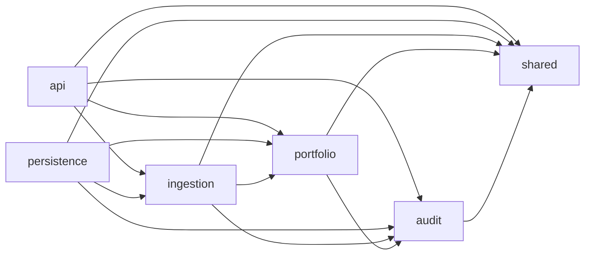

# Backend module boundaries

## Purpose

The backend is one deployable Spring Boot application with explicit logical modules. Package boundaries exist to protect business rules from delivery, persistence and provider details while avoiding premature multi-project or microservice decomposition.

The executable rules in this document apply to Release 0.1. New modules require an issue, an explicit dependency direction and an architecture-test update.

## Active modules

| Module | Root package | Responsibility | May depend on |
|---|---|---|---|
| `shared` | `br.com.vinicius.personalfinance.shared` | Framework-free value types, typed IDs, clocks and basic errors | Kotlin and JDK only |
| `audit` | `br.com.vinicius.personalfinance.audit` | Redacted audit contracts and correlation metadata | `shared` |
| `portfolio` | `br.com.vinicius.personalfinance.portfolio` | Financial accounts, assets, positions and effective snapshots | `shared`, `audit` |
| `ingestion` | `br.com.vinicius.personalfinance.ingestion` | Import lifecycle, extraction, parsing, preview and reconciliation | `shared`, `audit`, `portfolio` |
| `persistence` | `br.com.vinicius.personalfinance.persistence` | PostgreSQL, Flyway and implementations of module-owned ports | `shared`, `audit`, `portfolio`, `ingestion` |
| `api` | `br.com.vinicius.personalfinance.api` | Local REST delivery, validation and Problem Details | `shared`, `audit`, `portfolio`, `ingestion` |

## Dependency direction



The absence of an arrow is a prohibition. In particular:

- `shared`, `audit`, `portfolio` and `ingestion` cannot import `api` or `persistence`;
- `api` cannot access `persistence` directly;
- domain and application modules define ports; `persistence` implements them;
- public contracts live in a module root package or an explicitly declared named interface;
- subpackages are internal by default;
- future provider adapters stay under an adapter module and never enter `shared` or domain packages.

## Shared module constraints

`shared` is deliberately stricter than the other modules. It cannot reference:

- Spring Framework or Spring Boot;
- JDBC, Flyway, PostgreSQL or Testcontainers;
- provider SDKs;
- REST, servlet or serialization-specific types;
- application-module implementations.

A type belongs in `shared` only when at least two modules require the same stable semantic concept. Convenience helpers, DTOs and framework abstractions do not qualify.

## Enforcement

`ArchitectureTests` executes on every backend `check` and combines:

1. `ApplicationModules.of(PersonalFinanceApplication::class.java).verify()` for Spring Modulith cycle, API exposure and declared-dependency validation;
2. ArchUnit rules that forbid domain-to-adapter references;
3. an ArchUnit rule that prevents `api` from bypassing application modules and reaching `persistence`;
4. an ArchUnit rule that keeps `shared` free from framework and persistence dependencies;
5. a test-only intentional inversion proving that the domain-to-adapter rule detects violations.

The application declares `shared` as the Spring Modulith shared module. Other modules use `@ApplicationModule(allowedDependencies = …)` metadata at their root package.

## Package layout

```text
br.com.vinicius.personalfinance
├── PersonalFinanceApplication.kt
├── shared/
├── audit/
├── portfolio/
├── ingestion/
├── persistence/
│   └── health/
└── api/
```

Folders may contain `domain`, `application`, `internal`, `port` or adapter-specific subpackages when real behavior requires them. Empty layer packages are not created in advance.

## Change protocol

A change to the dependency matrix must:

1. explain the new collaboration and why an existing port or event is insufficient;
2. update this document and the Spring Modulith metadata;
3. add or modify an architecture test;
4. create a superseding ADR when the change alters a hard-to-reverse boundary;
5. remain inside one atomic issue and reviewed PR.

Disabling an architecture rule to make a feature compile is not an acceptable resolution. The dependency must be redirected through a module API, port or event, or the architectural decision must be explicitly replaced.
