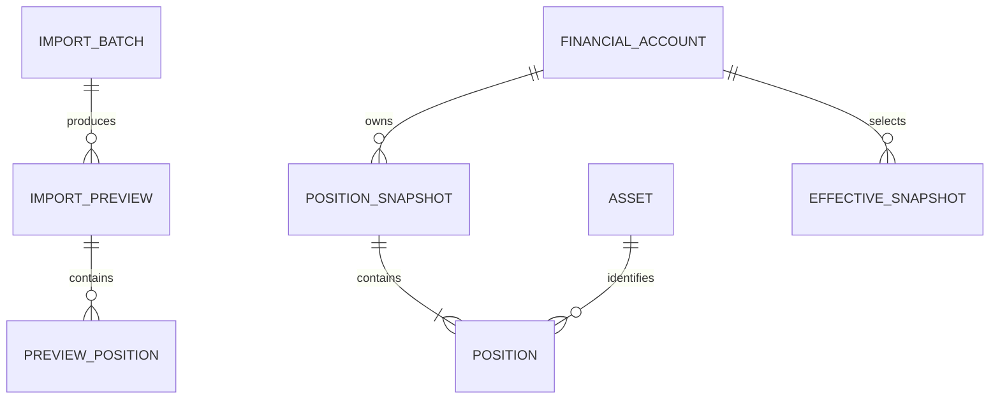

# Personal Finance Platform — Modelo de Domínio

> **Versão:** 1.0  
> **Derivado da Product Specification v5.0**  
> Este documento detalha o modelo conceitual. Em conflito, prevalece a Product Specification.

# 1. Objetivo

Definir entidades, agregados, tipos de valor, cardinalidades, invariantes e fronteiras conceituais da Release 0.1.

# 2. Contextos principais

```text
shared
portfolio
ingestion
audit
```

`persistence` e `api` são adapters/boundaries e não definem semântica financeira central.

# 3. Primitivos

- Money
- CurrencyCode
- ExchangeRate
- RoundingPolicy
- Quantity
- UnitPrice
- Rate
- DecimalRatio
- ValueQuality
- PositionDate
- ReportGeneratedAt
- MarketReferenceDate
- Typed IDs

# 4. ImportBatch

Responsável por:

- lifecycle;
- fingerprint;
- parser/layout selecionado;
- preview atual;
- decisão terminal;
- erro estável.

Estados:

```text
RECEIVED
FINGERPRINTED
PASSWORD_REQUIRED
EXTRACTING
DETECTING_LAYOUT
PARSING
NORMALIZING
RECONCILING
PREVIEW_READY
BLOCKED
COMMITTING
COMMITTED
REJECTED
FAILED
DUPLICATE
```

# 5. ImportPreview

Preview é versionada e não representa estado confirmado.

```text
ImportPreview
- importBatchId
- previewVersion
- sourceDescriptor
- parserDescriptor
- accounts
- positions
- reconciliation
- warnings
- blockers
- commitAllowed
```

Invariantes:

- apenas uma preview atual por import;
- commit exige preview atual;
- resolução material cria nova versão;
- preview não altera portfolio.

# 6. FinancialAccount

```text
FinancialAccount
- financialAccountId
- institution
- externalReference?
- displayName?
```

Referência externa não é ID interno.

# 7. Asset

```text
Asset
- assetId
- assetType
- canonicalName
- identifiers
```

Identidade por nome isolado não é forte.

# 8. PositionSnapshot

```text
PositionSnapshot
- snapshotId
- financialAccountId
- positionDate
- version
- createdAt
```

Snapshot confirmado é imutável.

# 9. Position

```text
Position
- positionId
- snapshotId
- assetId
- quantity
- unitPrice
- marketValue
- evidence
```

# 10. EffectiveSnapshot

Representa ponteiro explícito para a versão efetiva de uma chave lógica:

```text
FinancialAccountId + PositionDate
```

No máximo uma versão efetiva.

# 11. Evidence

```text
Evidence
- evidenceId
- importBatchId
- pageNumber?
- sectionKey?
- sourceLabel?
- normalizedFragmentHash?
- parserVersion
- ruleKey?
```

Não exige retenção do PDF bruto.

# 12. ReconciliationResult

```text
ReconciliationResult
- ruleCode
- scope
- currency
- expected
- calculated
- difference
- tolerance
- outcome
```

Outcomes:

- PASS
- WARNING
- BLOCKER
- NOT_APPLICABLE
- NOT_VERIFIABLE

`NOT_VERIFIABLE != PASS`.

# 13. Relações



# 14. Agregados conceituais

## Import aggregate

Protege lifecycle, preview e decisão.

## Portfolio snapshot boundary

Protege snapshot, positions, versão e efetividade.

# 15. Invariantes críticas

- Money sempre possui moeda.
- Unknown não é zero.
- Parser não grava estado confirmado.
- Preview não grava estado confirmado.
- Snapshot confirmado é imutável.
- Position não muda de snapshot.
- Uma chave lógica tem no máximo uma versão efetiva.
- Commit é atômico.
- Query não altera estado financeiro.
