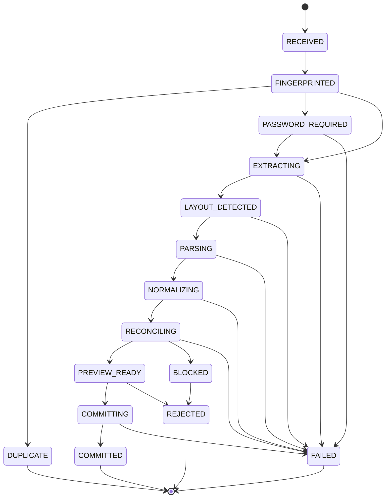
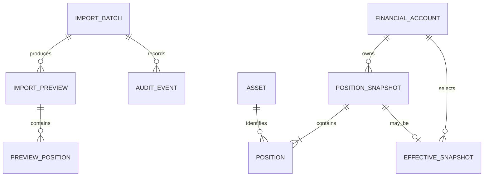

# Personal Finance Platform — Especificação de Produto

> **Status:** Especificação viva  
> **Versão do documento:** 5.0  
> **Release-alvo:** 0.1 — Snapshot Local de Posição  
> **Repositório:** `vinicius-ssantos/personal-finance-platform`  
> **Documento canônico proposto:** `docs/specification/PRODUCT-SPECIFICATION.md`  
> **Público:** proprietário do produto, mantenedores, revisores, agentes de desenvolvimento e futuros contribuidores  
> **Linguagem normativa:** `DEVE`, `NÃO DEVE`, `DEVERIA`, `PODE`

---

# Sumário

- 0. Precedência normativa, interpretação e estabilidade
- 1. Objetivo deste documento
- 2. Resumo executivo
- 3. Visão de longo prazo
- 4. Problema
- 5. Usuário-alvo
- 6. Princípios fundamentais do produto
- 7. Critérios de sucesso da Release 0.1
- 8. Escopo da Release 0.1
- 9. Baseline técnico estabelecido
- 10. Estado conhecido de implementação
- 11. Vocabulário de domínio
- 12. Invariantes globais
- 13. Primitivos financeiros
- 14. Tipos decimais
- 15. Qualidade de valor
- 16. Temporalidade financeira
- 17. IDs tipados
- 18. Máquina de estados do ImportBatch
- 19. Tabela de transições
- 20. Upload
- 21. Limites iniciais de upload
- 22. Arquivo fonte efêmero
- 23. PDF protegido por senha
- 24. Fingerprint e idempotência
- 25. Extração de PDF
- 26. Detecção de layout
- 27. Parser Registry
- 28. Estratégia de fontes suportadas
- 29. Fixtures
- 30. Modelo de evidência
- 31. Normalização
- 32. Identidade de ativos
- 33. Reconciliação
- 34. Tolerância financeira
- 35. Preview
- 36. Estrutura conceitual de preview
- 37. Stale preview
- 38. Commit
- 39. Rejeição
- 40. Snapshots
- 41. Chave lógica do snapshot
- 42. Concorrência
- 43. Auditoria
- 44. Conteúdo de auditoria
- 45. Catálogo estável de erros
- 46. Contrato de erro REST
- 47. Mapeamento HTTP recomendado
- 48. API conceitual da Release 0.1
- 49. Requisitos de banco
- 50. Modelo conceitual de persistência
- 51. Constraints importantes
- 52. Arquitetura modular
- 53. Requisitos arquiteturais
- 54. Privacidade
- 55. Segurança
- 56. Threat model resumido
- 57. Logging
- 58. Correlation ID
- 59. Observabilidade
- 60. Reliability
- 61. Backup e restore
- 62. Performance
- 63. Timeouts
- 64. Testes de primitivos
- 65. Testes de propriedade
- 66. Testes do lifecycle
- 67. Testes do parser
- 68. Testes de segurança
- 69. Testes de integração
- 70. Testes arquiteturais
- 71. CI
- 72. Definition of Done de uma issue
- 73. Definition of Done da Release 0.1
- 74. Jornada principal do usuário
- 75. Jornada de erro — layout desconhecido
- 76. Jornada de erro — reconciliação
- 77. Jornada de erro — preview stale
- 78. Consistência transacional
- 79. Web
- 80. Mobile
- 81. Open Finance
- 82. Analytics futuros
- 83. Não objetivos permanentes
- 84. Roadmap sugerido
- 85. Matriz de rastreabilidade inicial
- 86. Convenção de rastreabilidade em issues
- 87. Governança da especificação
- 88. Quando criar ADR
- 89. Quando não criar ADR
- 90. Perguntas em aberto
- 91. Anti-requisitos
- 92. Gates obrigatórios antes de merge
- 93. Gate de parser novo
- 94. Gate de release
- 95. Estrutura documental recomendada
- 96. Política de versionamento da especificação
- 97. Critério de compatibilidade
- 98. Filosofia de implementação
- 99. Glossário normativo
- 100. Classificação e prioridade dos requisitos
- 101. Registro mestre de requisitos
- 102. Unidade de decisão e proibição de commit parcial
- 103. Contrato formal de idempotência
- 104. Classificação de dados
- 105. Matriz de retenção
- 106. Locale, números e datas de entrada
- 107. Normalização de texto
- 108. Identidade de ativo e confiança
- 109. Evidence — contrato mínimo
- 110. Preview digest
- 111. Warnings e blockers
- 112. Catálogo de erro com retryability
- 113. Paginação, ordenação e consistência de leitura
- 114. Compatibilidade do parser
- 115. Compatibilidade de schema e migrations
- 116. Política de exclusão de dados
- 117. Clock e timezone
- 118. SLOs e limites locais
- 119. Observabilidade — requisitos adicionais
- 120. Cenários de aceite — Given / When / Then
- 121. Matriz de casos de uso
- 122. Modelo conceitual de agregados
- 123. Estrutura conceitual de comando de commit
- 124. Estrutura conceitual de resposta de import
- 125. Segurança do boundary de upload
- 126. Recovery e reprocessamento
- 127. Estados de terminalidade
- 128. Política de warnings
- 129. Critério de blocker
- 130. Contrato de ordenação de posições
- 131. Canonicalização para hashing
- 132. Backup e objetivos de recuperação
- 133. Política de configuração
- 134. Contrato de readiness
- 135. Separação entre erro de fonte e erro de plataforma
- 136. Matriz de testabilidade por requisito
- 137. Registro de decisões em aberto
- 138. Checklist de revisão da especificação
- 139. Changelog da especificação
- 140. Resumo de obrigatoriedade para a Release 0.1
- 141. Resumo normativo
- 142. Conclusão

---

# 0. Precedência normativa, interpretação e estabilidade

## 0.1 Linguagem normativa

Neste documento:

- **DEVE / DEVEM** indica requisito obrigatório;
- **NÃO DEVE / NÃO DEVEM** indica proibição obrigatória;
- **DEVERIA / DEVERIAM** indica comportamento recomendado, que só deve ser desviado com justificativa;
- **PODE / PODEM** indica comportamento opcional;
- **TBD** indica decisão ainda não fechada e que não pode ser assumida silenciosamente pela implementação.

## 0.2 Precedência entre documentos

Quando houver conflito aparente, a resolução DEVE seguir esta ordem:

```text
1. requisito explícito desta especificação
2. ADR aceito que detalhe ou superseda tecnicamente o requisito
3. contrato de arquitetura vigente
4. contrato de API/schema versionado
5. issue/PR específica
6. implementação atual
```

Código existente NÃO transforma automaticamente um comportamento em requisito.

Se o código divergir da especificação, a divergência DEVE ser:

- corrigida no código; ou
- formalizada por mudança da especificação e, quando aplicável, por ADR.

## 0.3 Requisito de supersessão

Uma decisão nova que substitua uma decisão normativa anterior DEVE registrar:

- requisito/ADR anterior;
- motivo da mudança;
- impacto de compatibilidade;
- plano de migração;
- versão a partir da qual a nova regra vale.

## 0.4 Estado de implementação não é norma

Seções que descrevem “estado atual”, “em andamento” ou “próximo corte” são informativas.

Elas NÃO DEVEM ser usadas como fonte superior ao comportamento normativo.

## 0.5 Princípio de não inferência

Quando esta especificação não definir um comportamento crítico:

> a implementação NÃO DEVE inventar uma regra silenciosa.

Deve existir:

- uma decisão explícita na issue;
- atualização desta especificação; ou
- ADR, se a decisão for estrutural.

---

# 1. Objetivo deste documento

Este documento define **o que o Personal Finance Platform deve fazer**, quais garantias de produto precisa preservar e quais comportamentos são obrigatórios para a Release 0.1.

Ele deve funcionar como contrato central entre:

- visão de produto;
- arquitetura;
- ADRs;
- roadmap;
- issues;
- pull requests;
- código;
- testes;
- documentação operacional.

A hierarquia recomendada é:

```text
Especificação de Produto
        ↓
Arquitetura
        ↓
ADRs
        ↓
Roadmap / Releases
        ↓
Issues
        ↓
Pull Requests
        ↓
Código e testes
```

A especificação descreve **resultado esperado e comportamento**.

Os ADRs descrevem **decisões difíceis de reverter**.

A documentação de arquitetura descreve **como o sistema é organizado para cumprir a especificação**.

As issues implementam **fatias pequenas e rastreáveis** desta especificação.

---

# 2. Resumo executivo

O Personal Finance Platform é uma plataforma pessoal de finanças, inicialmente **local-first**, criada para consolidar posições financeiras provenientes de relatórios fornecidos pelo próprio usuário.

O primeiro problema que o projeto resolve não é orçamento, gastos ou categorização de transações.

O primeiro problema é:

> Transformar relatórios financeiros heterogêneos em snapshots patrimoniais confiáveis, versionados, auditáveis e revisáveis, sem inventar informações financeiras silenciosamente.

A Release 0.1 deve provar um fluxo completo:

```text
Relatório financeiro
        ↓
Upload local seguro
        ↓
Fingerprint / idempotência
        ↓
Extração de texto
        ↓
Detecção de layout
        ↓
Parser versionado
        ↓
Normalização
        ↓
Reconciliação
        ↓
Preview versionada
        ↓
Decisão explícita do usuário
        ↓
Commit transacional
        ↓
Snapshot imutável
        ↓
Versão efetiva consultável
```

---

# 3. Visão de longo prazo

A visão de longo prazo é uma plataforma pessoal capaz de:

- consolidar patrimônio em múltiplas instituições;
- manter histórico patrimonial;
- importar relatórios financeiros;
- importar formatos estruturados como CSV/OFX quando suportados;
- integrar futuramente com Open Finance;
- reconciliar valores declarados com posições extraídas;
- distinguir informação exata, estimada e desconhecida;
- trabalhar com múltiplas moedas;
- produzir análises de patrimônio;
- acompanhar aportes;
- analisar concentração e liquidez;
- calcular retorno;
- projetar metas;
- simular compra de imóvel;
- suportar interface web;
- suportar aplicativo Android nativo;
- permitir integrações adicionais sem acoplar o domínio a provedores.

A Release 0.1 é deliberadamente menor que essa visão.

---

# 4. Problema

Dados financeiros pessoais normalmente estão espalhados entre:

- bancos;
- corretoras;
- instituições de investimento;
- relatórios em PDF;
- planilhas;
- interfaces proprietárias;
- históricos parciais.

Os relatórios apresentam problemas como:

- formatos diferentes entre instituições;
- alteração de layout sem versionamento público;
- PDFs protegidos por senha;
- campos ausentes;
- valores apresentados em moedas distintas;
- falta de identidade uniforme para ativos;
- totais que podem não reconciliar automaticamente;
- reimportação duplicada;
- ausência de rastreabilidade;
- dificuldade de reconstruir histórico;
- risco de substituir estado anterior por engano.

A plataforma deve solucionar esses problemas por meio de um pipeline controlado de ingestão.

---

# 5. Usuário-alvo

## 5.1 Persona principal da Release 0.1

O usuário da primeira release é o proprietário da instalação local.

Características:

- ambiente single-user;
- possui os documentos importados;
- executa a aplicação localmente;
- tem familiaridade técnica suficiente para iniciar serviços locais;
- espera comportamento determinístico;
- prefere privacidade e auditabilidade a automação agressiva;
- aceita revisar uma preview antes de confirmar dados.

## 5.2 Fora da persona da Release 0.1

A primeira release não é projetada para:

- consultorias financeiras;
- múltiplos clientes;
- famílias com permissões compartilhadas;
- equipes;
- SaaS multi-tenant;
- usuários públicos anônimos;
- instituições financeiras.

---

# 6. Princípios fundamentais do produto

## 6.1 Correção acima de conveniência

Quando houver dúvida, o sistema DEVE preferir apresentar uma informação como incerta ou bloqueada em vez de assumir um valor.

## 6.2 Desconhecido não é zero

Ausência de informação NÃO DEVE ser convertida em `0`.

Exemplo:

```text
quantidade ausente ≠ quantidade 0
preço ausente      ≠ preço 0
saldo não informado ≠ saldo 0
```

## 6.3 Preview antes de commit

Parsing e normalização NÃO DEVEM alterar o patrimônio confirmado.

O sistema DEVE gerar preview antes de qualquer commit.

## 6.4 Histórico financeiro imutável

Snapshots confirmados NÃO DEVEM ser sobrescritos silenciosamente.

Correções DEVEM gerar nova versão.

## 6.5 Moeda explícita

Todo valor monetário DEVE carregar moeda.

Operações cross-currency DEVEM exigir conversão explícita.

## 6.6 Temporalidade explícita

Datas diferentes com significados financeiros diferentes NÃO DEVEM ser representadas pelo mesmo campo genérico.

## 6.7 Privacidade local-first

A Release 0.1 NÃO DEVE depender de processamento externo de documentos financeiros.

## 6.8 Determinismo

O mesmo:

- arquivo;
- versão de parser;
- configuração;
- política de arredondamento;

DEVERIA produzir o mesmo resultado.

## 6.9 Evidência

Valores importados DEVERIAM manter proveniência suficiente para explicar de onde vieram.

## 6.10 Evolução incremental

A arquitetura NÃO DEVE antecipar componentes distribuídos sem necessidade comprovada.

---

# 7. Critérios de sucesso da Release 0.1

A Release 0.1 será considerada funcional quando for possível:

1. iniciar a infraestrutura local;
2. iniciar o backend;
3. enviar um relatório suportado;
4. detectar duplicidade;
5. informar senha quando necessário;
6. extrair texto nativo do PDF;
7. identificar o layout;
8. selecionar parser versionado;
9. normalizar posições;
10. reconciliar totais;
11. receber uma preview versionada;
12. visualizar warnings e blockers;
13. confirmar explicitamente a preview;
14. produzir snapshot imutável;
15. tornar uma versão efetiva;
16. consultar o snapshot efetivo;
17. consultar histórico;
18. reproduzir o fluxo com fixture sintética;
19. executar tudo sem serviço externo pago;
20. passar todos os gates automatizados.

---

# 8. Escopo da Release 0.1

## 8.1 Incluído

A Release 0.1 inclui:

- backend local;
- PostgreSQL;
- Flyway;
- monólito modular;
- primitivos financeiros;
- IDs tipados;
- lifecycle de `ImportBatch`;
- auditoria;
- catálogo de erros;
- upload local;
- PDF protegido por senha;
- armazenamento efêmero do arquivo fonte;
- fingerprint;
- idempotência;
- extração nativa de texto;
- detecção de layout;
- parser registry versionado;
- pelo menos uma família realista de relatório;
- fixtures sintéticas;
- normalização;
- modelo de evidência;
- qualidade de valor;
- reconciliação multimoeda;
- preview versionada;
- blockers;
- warnings;
- commit;
- rejeição;
- snapshots imutáveis;
- versão efetiva;
- leitura de snapshots;
- health/readiness;
- testes unitários;
- testes arquiteturais;
- testes de integração com PostgreSQL real.

## 8.2 Fora do escopo

Não fazem parte da Release 0.1:

- Open Finance;
- sincronização automática bancária;
- OCR;
- processamento de PDF por LLM externo;
- serviço de IA externo para parsing;
- deploy público;
- autenticação remota;
- multi-user;
- multi-tenant;
- aplicativo Android;
- MCP financeiro;
- orçamento mensal;
- categorização de gastos;
- fatura de cartão;
- fluxo de caixa completo;
- recomendação de investimento;
- trading;
- execução de pagamentos;
- declaração de imposto;
- market data em tempo real;
- Kafka;
- Redis;
- Kubernetes;
- microserviços;
- event sourcing;
- filas como requisito do caminho principal.

---

# 9. Baseline técnico estabelecido

O projeto já estabeleceu como direção:

- Kotlin/JVM;
- JDK 25;
- Spring Boot;
- Spring Modulith;
- PostgreSQL;
- Flyway;
- Testcontainers;
- Gradle Wrapper;
- Docker Compose;
- Detekt;
- Ktlint;
- ArchUnit;
- GitHub Actions.

O backend é um monólito modular.

Módulos atuais:

```text
shared
audit
portfolio
ingestion
persistence
api
```

---

# 10. Estado conhecido de implementação

## 10.1 Concluído

Já foram estabelecidos:

- bootstrap do repositório;
- backend Kotlin/JVM;
- PostgreSQL local;
- Flyway;
- Testcontainers;
- Docker Compose;
- readiness de banco/migração;
- arquitetura modular;
- Spring Modulith;
- regras ArchUnit;
- ADRs bloqueantes.

## 10.2 Em andamento

A issue de primitivos financeiros introduz:

- `Money`;
- `CurrencyCode`;
- `ExchangeRate`;
- `RoundingPolicy`;
- `Quantity`;
- `UnitPrice`;
- `Rate`;
- `DecimalRatio`;
- `ValueQuality`;
- IDs tipados;
- temporalidade financeira;
- clock injetável.

## 10.3 Próximo corte

Depois dos primitivos, a próxima fatia central é:

> Lifecycle de `ImportBatch`, trilha de auditoria e catálogo estável de erros.

---

# 11. Vocabulário de domínio

## 11.1 ImportBatch

Representa uma tentativa de importação.

Um `ImportBatch` DEVE possuir identidade estável.

Deverá registrar, diretamente ou por eventos relacionados:

- ID;
- fingerprint;
- status;
- instituição;
- família do documento;
- versão do layout;
- versão do parser;
- timestamps técnicos;
- correlation ID;
- versão da preview;
- código de erro;
- decisão terminal.

## 11.2 FinancialAccount

Representa o agrupador financeiro ao qual posições pertencem.

Exemplos:

- conta de investimento;
- conta de corretora;
- carteira;
- conta bancária com investimentos.

## 11.3 Asset

Representa identidade de um ativo financeiro.

A identidade exata depende do tipo.

Pode conter futuramente:

- ticker;
- ISIN;
- CNPJ de fundo;
- código interno da instituição;
- nome normalizado;
- moeda;
- categoria.

## 11.4 Position

Representa uma posição financeira em uma data.

Pode conter:

- ativo;
- quantidade;
- preço unitário;
- valor de mercado;
- moeda;
- qualidade dos valores;
- evidência.

## 11.5 PositionSnapshot

Coleção imutável de posições confirmadas para:

- uma conta;
- uma `PositionDate`;
- uma versão.

## 11.6 EffectiveSnapshotVersion

Ponteiro explícito para a versão considerada atual.

## 11.7 ImportPreview

Resultado revisável de uma importação antes do commit.

Preview NÃO É patrimônio confirmado.

## 11.8 Evidence

Informação que permite explicar a origem de um valor.

Exemplos:

- página;
- seção;
- linha lógica;
- label encontrada;
- trecho normalizado;
- parser;
- regra aplicada.

---

# 12. Invariantes globais

Os invariantes abaixo são obrigatórios.

### INV-001 — dinheiro nunca sem moeda

Todo `Money` DEVE possuir moeda.

### INV-002 — sem soma cross-currency implícita

BRL + USD é inválido sem conversão.

### INV-003 — desconhecido diferente de zero

`Unknown` e `Exact(0)` são estados diferentes.

### INV-004 — snapshot confirmado é imutável

Uma versão confirmada NÃO DEVE ser editada.

### INV-005 — somente uma versão efetiva

Para uma mesma chave lógica de conta/data, no máximo uma versão pode ser efetiva.

### INV-006 — parser não confirma patrimônio

Parser NÃO DEVE escrever posições confirmadas.

### INV-007 — preview não confirma patrimônio

Criar preview NÃO DEVE alterar versão efetiva.

### INV-008 — commit exige preview atual

Preview obsoleta NÃO DEVE ser commitada.

### INV-009 — commit é atômico

Snapshot, posições, auditoria e ponteiro efetivo DEVEM ser persistidos na mesma unidade transacional.

### INV-010 — arquivo real não vai para Git

Relatórios reais NÃO DEVEM ser versionados.

### INV-011 — senha não é persistida

Senha de PDF NÃO DEVE ser gravada em banco ou logs.

### INV-012 — dados financeiros não usam floating point

`Float` e `Double` NÃO DEVEM representar valores financeiros.

---

# 13. Primitivos financeiros

## 13.1 CurrencyCode

Moedas inicialmente suportadas:

```text
BRL
USD
```

A inclusão de nova moeda DEVE definir:

- código;
- número de casas;
- comportamento de conversão;
- cobertura de testes.

## 13.2 Money

Representação canônica:

```text
amountMinor: Long
currency: CurrencyCode
```

Exemplo:

```text
R$ 123,45
→ amountMinor = 12345
→ currency = BRL
```

## 13.3 Operações

São permitidas:

- soma na mesma moeda;
- subtração na mesma moeda;
- comparação na mesma moeda;
- multiplicação inteira controlada;
- conversão explícita.

São proibidas:

- soma entre moedas;
- comparação entre moedas;
- conversão implícita;
- uso de `Double`.

## 13.4 Overflow

Operações monetárias DEVEM falhar em overflow.

Não podem fazer wrap silencioso.

## 13.5 ExchangeRate

Uma taxa DEVE conter:

```text
source
target
ratio
```

Exemplo:

```text
USD → BRL
ratio = 5.25
```

A direção importa.

## 13.6 RoundingPolicy

Políticas inicialmente estabelecidas:

- `EXACT`;
- `HALF_EVEN`;
- `HALF_UP`;
- `DOWN`.

Arredondamento silencioso NÃO DEVE ocorrer.

---

# 14. Tipos decimais

Escalas canônicas:

| Tipo | Escala |
|---|---:|
| `Quantity` | 12 |
| `UnitPrice` | 8 |
| `Rate` | 12 |
| `DecimalRatio` | 12 |

## 14.1 Quantidade

Quantidade PODE ser fracionária.

Restrições negativas devem pertencer ao domínio específico do ativo, não ao tipo genérico, salvo decisão futura.

## 14.2 UnitPrice

Preço unitário NÃO DEVE ser negativo.

## 14.3 DecimalRatio

Convenção:

```text
0.30 = 30%
0.075 = 7,5%
1.00 = 100%
```

---

# 15. Qualidade de valor

Modelo mínimo:

```text
Unknown
Estimated(value)
Exact(value)
```

## 15.1 Unknown

Não existe valor suficientemente confiável.

## 15.2 Estimated

Existe valor, porém não é exato.

## 15.3 Exact

A fonte ou regra determinística sustenta o valor.

## 15.4 Extensões futuras

Podem surgir:

```text
Derived(value, rule)
Conflicting(candidates)
```

Mas qualquer extensão DEVE ser consistente entre:

- domínio;
- persistência;
- preview;
- API;
- analytics.

---

# 16. Temporalidade financeira

## 16.1 PositionDate

Data econômica da posição.

Tipo:

```text
LocalDate
```

## 16.2 ReportGeneratedAt

Momento técnico de geração do relatório.

Tipo:

```text
Instant
```

## 16.3 MarketReferenceDate

Data de referência da cotação/mercado.

Tipo:

```text
LocalDate
```

Pode ser `Unknown`.

## 16.4 CreatedAt / UpdatedAt

São timestamps técnicos.

NÃO substituem datas financeiras.

---

# 17. IDs tipados

IDs de domínio NÃO DEVEM circular como strings sem tipo dentro do core.

Exemplos:

```text
ImportBatchId
FinancialAccountId
AssetId
PositionSnapshotId
```

Objetivo:

evitar erros como:

```kotlin
loadSnapshot(importBatchId)
```

quando o método exige `PositionSnapshotId`.

---

# 18. Máquina de estados do ImportBatch

A implementação DEVE possuir máquina de estados explícita ou comportamento equivalente verificável.

Modelo conceitual:



A implementação real pode combinar estados internos quando não houver diferença semântica relevante.

---

# 19. Tabela de transições

| Estado atual | Evento | Próximo estado | Permitido |
|---|---|---|---|
| RECEIVED | fingerprint calculado | FINGERPRINTED | sim |
| FINGERPRINTED | duplicata confirmada | DUPLICATE | sim |
| FINGERPRINTED | PDF requer senha | PASSWORD_REQUIRED | sim |
| FINGERPRINTED | documento acessível | EXTRACTING | sim |
| PASSWORD_REQUIRED | senha válida | EXTRACTING | sim |
| PASSWORD_REQUIRED | limite excedido | FAILED | sim |
| EXTRACTING | texto extraído | LAYOUT_DETECTED | sim |
| LAYOUT_DETECTED | parser selecionado | PARSING | sim |
| PARSING | candidatos produzidos | NORMALIZING | sim |
| NORMALIZING | domínio normalizado | RECONCILING | sim |
| RECONCILING | sem blocker | PREVIEW_READY | sim |
| RECONCILING | blocker | BLOCKED | sim |
| PREVIEW_READY | usuário confirma | COMMITTING | sim |
| PREVIEW_READY | usuário rejeita | REJECTED | sim |
| COMMITTING | transação conclui | COMMITTED | sim |
| COMMITTING | transação falha | FAILED | sim |
| COMMITTED | qualquer mutação | — | não |
| REJECTED | commit | — | não |
| FAILED | commit direto | — | não |

Transições inválidas DEVEM falhar com código estável.

---

# 20. Upload

### FR-UPLOAD-001

A aplicação DEVE aceitar um arquivo financeiro suportado.

### FR-UPLOAD-002

O tamanho do upload DEVE possuir limite configurável.

### FR-UPLOAD-003

A aplicação NÃO DEVE confiar apenas em extensão de arquivo.

### FR-UPLOAD-004

O nome de armazenamento temporário DEVE ser gerado pelo servidor.

### FR-UPLOAD-005

O caminho real do filesystem NÃO DEVE ser retornado.

### FR-UPLOAD-006

O arquivo fonte DEVE ser tratado como sensível.

### FR-UPLOAD-007

Arquivo temporário DEVE ser removido ao fim da política de retenção.

### FR-UPLOAD-008

Falha durante ingestão NÃO DEVE deixar arquivos órfãos indefinidamente.

---

# 21. Limites iniciais de upload

Valores exatos devem ficar configuráveis.

Defaults recomendados para a Release 0.1:

```text
Tamanho máximo do PDF: 25 MiB
Máximo de páginas: 250
Máximo de tentativas de senha: 5
TTL da continuação de senha: 15 minutos
```

Estes valores são guardrails iniciais, não regras econômicas.

Alterações futuras podem ser feitas sem ADR caso não mudem o modelo de segurança.

---

# 22. Arquivo fonte efêmero

O arquivo bruto:

- DEVE existir somente durante o período necessário;
- NÃO DEVE ser armazenado permanentemente na Release 0.1;
- NÃO DEVE aparecer em logs;
- NÃO DEVE ir para artifacts de CI;
- NÃO DEVE ir para Git.

Metadados permitidos após remoção:

- fingerprint;
- tamanho;
- tipo detectado;
- nome original redigido ou opcional;
- timestamps;
- parser selecionado;
- evidências sanitizadas.

---

# 23. PDF protegido por senha

### FR-PASSWORD-001

Se o PDF exigir senha, o import DEVE entrar em estado recuperável.

### FR-PASSWORD-002

A senha DEVE ser vinculada a um `ImportBatchId`.

### FR-PASSWORD-003

A senha NÃO DEVE ser persistida.

### FR-PASSWORD-004

A senha NÃO DEVE aparecer em:

- log;
- trace;
- metric;
- erro;
- auditoria;
- resposta;
- banco.

### FR-PASSWORD-005

Tentativas DEVEM ter limite.

### FR-PASSWORD-006

O mecanismo DEVE impedir reutilização indefinida da continuação.

### FR-PASSWORD-007

Após TTL, nova submissão da senha DEVE ser exigida.

---

# 24. Fingerprint e idempotência

## 24.1 Fingerprint

A aplicação DEVE calcular hash determinístico do conteúdo.

Recomendação:

```text
SHA-256
```

O algoritmo exato pode ser mudado mediante migração se necessário.

## 24.2 Duplicidade

Uma duplicata é, inicialmente:

```text
mesmo fingerprint de conteúdo
```

## 24.3 Comportamento de duplicata

A aplicação NÃO DEVE criar silenciosamente um novo estado financeiro confirmado a partir do mesmo arquivo.

A resposta deve permitir distinguir:

- novo import;
- fonte já conhecida;
- reprocessamento solicitado;
- duplicata já commitada.

## 24.4 Reprocessamento

Reprocessamento com parser novo PODE ser permitido futuramente.

Nesse caso deve registrar:

- import original;
- parser anterior;
- parser novo;
- nova preview;
- eventual novo snapshot.

---

# 25. Extração de PDF

### FR-PDF-001

A Release 0.1 DEVE usar extração nativa de texto.

### FR-PDF-002

PDFBox é a biblioteca selecionada.

### FR-PDF-003

OCR automático NÃO DEVE existir na Release 0.1.

### FR-PDF-004

PDF sem texto suficiente DEVE falhar de forma segura.

### FR-PDF-005

A extração DEVERIA preservar número da página.

### FR-PDF-006

Conteúdo ativo do PDF NÃO DEVE ser executado.

### FR-PDF-007

A extração DEVE possuir limites de tempo/memória compatíveis com o ambiente local.

---

# 26. Detecção de layout

A detecção deve ocorrer antes do parser de domínio.

### FR-LAYOUT-001

Deve identificar:

- instituição;
- família;
- layout/versionamento conhecido.

### FR-LAYOUT-002

Layout desconhecido DEVE falhar fechado.

### FR-LAYOUT-003

Não pode existir fallback:

```text
"parece parecido, então tenta"
```

para confirmação automática.

### FR-LAYOUT-004

O resultado DEVERIA registrar evidências.

---

# 27. Parser Registry

Identidade conceitual:

```text
institution
documentFamily
layoutVersion
parserVersion
```

Exemplo:

```text
INTER
CONSOLIDATED_POSITION
2026_01
1
```

### FR-PARSER-001

Um layout conhecido DEVE selecionar parser explicitamente.

### FR-PARSER-002

O parser DEVE ser determinístico.

### FR-PARSER-003

Mudança incompatível DEVE criar nova versão.

### FR-PARSER-004

A versão usada DEVE ser persistida.

### FR-PARSER-005

Parser NÃO DEVE acessar persistência de portfolio diretamente.

### FR-PARSER-006

Parser DEVE produzir candidatos, não entidades confirmadas.

---

# 28. Estratégia de fontes suportadas

O produto DEVE manter matriz explícita.

Exemplo:

| Instituição | Família | Layout | Parser | Status |
|---|---|---|---|---|
| Banco Inter | relatório consolidado | a definir | v1 | alvo inicial |

Não se deve afirmar:

> "Banco Inter suportado"

quando apenas um tipo específico de relatório foi testado.

A comunicação correta é:

> "Relatório consolidado X, layout Y, suportado".

---

# 29. Fixtures

### FR-FIXTURE-001

Relatórios reais permanecem privados.

### FR-FIXTURE-002

Fixtures versionadas DEVEM ser sintéticas.

### FR-FIXTURE-003

Fixtures DEVEM preservar estrutura relevante.

### FR-FIXTURE-004

Fixtures NÃO DEVEM conter:

- nome real;
- CPF;
- conta real;
- senha real;
- valores reais copiados;
- metadata privada.

### FR-FIXTURE-005

Cada parser DEVERIA possuir:

- happy path;
- campo ausente;
- valor malformado;
- layout não reconhecido;
- mismatch;
- múltiplas moedas;
- documento protegido quando aplicável.

---

# 30. Modelo de evidência

Cada campo importado importante DEVERIA poder apontar para evidência.

Modelo conceitual:

```text
Evidence
- sourcePage
- section
- sourceLabel
- normalizedTextHash
- parserVersion
- extractionRule
```

O sistema NÃO precisa armazenar permanentemente o texto financeiro completo para manter evidência.

Sempre que possível, deve armazenar uma representação sanitizada.

---

# 31. Normalização

Parsing produz representação específica da fonte.

Normalização converte para tipos canônicos.

A normalização DEVE:

- mapear moeda;
- mapear decimais;
- preservar desconhecido;
- preservar qualidade;
- separar datas;
- preservar evidência;
- rejeitar ambiguidades críticas;
- não realizar conversão cambial implícita.

---

# 32. Identidade de ativos

Identidade de ativo é uma área de risco.

A Release 0.1 NÃO DEVE fazer merge agressivo somente por nome.

Prioridade conceitual:

```text
identificador forte
    ↓
identificador da instituição
    ↓
chave composta confiável
    ↓
nome normalizado com baixa confiança
```

Quando a identidade não for confiável:

- preview pode apresentar resolução pendente;
- commit pode ser bloqueado;
- sistema NÃO DEVE fundir ativos silenciosamente.

---

# 33. Reconciliação

Reconciliação verifica consistência entre:

- candidatos;
- subtotais;
- totais declarados;
- moedas;
- seções.

### FR-RECON-001

Reconciliação DEVE ocorrer por moeda.

### FR-RECON-002

BRL e USD NÃO DEVEM ser somados diretamente.

### FR-RECON-003

Tolerância DEVE ser explícita.

### FR-RECON-004

Resultado DEVE ser classificado em:

```text
PASS
WARNING
BLOCKER
```

### FR-RECON-005

`BLOCKER` impede commit.

### FR-RECON-006

`WARNING` pode permitir commit conforme política.

---

# 34. Tolerância financeira

A tolerância inicial DEVE ser definida no caso de uso.

Exemplo conceitual:

```text
BRL: até 1 centavo
USD: até 1 centavo
```

Mas o valor correto depende da natureza do relatório.

A tolerância NÃO DEVE ser usada para esconder erros sistemáticos.

---

# 35. Preview

Preview é um contrato de produto, não apenas DTO interno.

### FR-PREVIEW-001

Toda importação commitável DEVE possuir preview.

### FR-PREVIEW-002

Preview DEVE possuir versão.

### FR-PREVIEW-003

Preview DEVE informar:

- instituição;
- família;
- layout;
- parser;
- conta;
- data da posição;
- posições;
- moeda;
- quantidade;
- preço;
- valor;
- qualidade;
- evidência relevante;
- totais;
- warnings;
- blockers.

### FR-PREVIEW-004

Preview NÃO altera snapshot efetivo.

### FR-PREVIEW-005

Commit DEVE enviar `previewVersion`.

### FR-PREVIEW-006

Versão obsoleta DEVE resultar em erro estável.

---

# 36. Estrutura conceitual de preview

```json
{
  "importId": "...",
  "previewVersion": 3,
  "source": {
    "institution": "INTER",
    "documentFamily": "CONSOLIDATED_POSITION",
    "layoutVersion": "..."
  },
  "parser": {
    "version": "1"
  },
  "positionDate": "2026-07-01",
  "accounts": [],
  "positions": [],
  "reconciliation": [],
  "warnings": [],
  "blockers": [],
  "commitAllowed": true
}
```

O contrato real será formalizado pela issue de API.

---

# 37. Stale preview

Preview fica stale quando uma condição relevante mudou.

Exemplos:

- nova resolução;
- novo parsing;
- reprocessamento;
- mudança da preview;
- nova versão concorrente.

Commit com versão stale:

```text
NÃO DEVE atualizar patrimônio.
```

Código sugerido:

```text
PREVIEW_VERSION_CONFLICT
```

---

# 38. Commit

### FR-COMMIT-001

Somente preview atual pode ser commitada.

### FR-COMMIT-002

Commit DEVE ser ação explícita.

### FR-COMMIT-003

Release 0.1 utiliza commit síncrono.

### FR-COMMIT-004

A transação DEVE incluir:

- snapshot;
- posições;
- evidências persistidas;
- auditoria;
- ponteiro efetivo.

### FR-COMMIT-005

Falha causa rollback completo.

### FR-COMMIT-006

Resposta de sucesso somente após commit do banco.

### FR-COMMIT-007

Retry do mesmo comando NÃO DEVE criar snapshots duplicados.

---

# 39. Rejeição

Usuário pode rejeitar preview.

### FR-REJECT-001

Rejeição DEVE tornar o estado terminal.

### FR-REJECT-002

Rejeição DEVE ser auditada.

### FR-REJECT-003

Import rejeitado NÃO pode ser commitado posteriormente sem reprocessamento explícito.

---

# 40. Snapshots

### FR-SNAPSHOT-001

Snapshot confirmado é imutável.

### FR-SNAPSHOT-002

Correção cria nova versão.

### FR-SNAPSHOT-003

Histórico permanece consultável.

### FR-SNAPSHOT-004

Versão efetiva é explícita.

### FR-SNAPSHOT-005

"Último ID" NÃO define estado atual.

### FR-SNAPSHOT-006

"Último created_at" NÃO define necessariamente estado atual.

---

# 41. Chave lógica do snapshot

Conceitualmente:

```text
FinancialAccountId
+
PositionDate
```

pode identificar uma linha de versões.

Exemplo:

```text
Conta A
2026-07-01
 ├── versão 1
 ├── versão 2
 └── versão 3 ← efetiva
```

A implementação física pode usar tabela de ponteiro.

---

# 42. Concorrência

Operações de commit DEVEM tratar concorrência.

Casos:

- duas confirmações simultâneas;
- duas previews concorrentes;
- commit antigo depois de preview nova.

Mecanismos possíveis:

- optimistic locking;
- constraint;
- `SELECT ... FOR UPDATE`;
- versão de aggregate.

A escolha é arquitetural, mas o comportamento do produto é:

> no máximo um resultado efetivo consistente.

---

# 43. Auditoria

Eventos importantes DEVEM ser auditáveis.

Eventos candidatos:

```text
IMPORT_CREATED
SOURCE_FINGERPRINTED
PASSWORD_REQUIRED
PASSWORD_ACCEPTED
EXTRACTION_COMPLETED
LAYOUT_DETECTED
PARSER_SELECTED
PREVIEW_CREATED
PREVIEW_BLOCKED
IMPORT_REJECTED
COMMIT_STARTED
SNAPSHOT_COMMITTED
EFFECTIVE_VERSION_CHANGED
IMPORT_FAILED
```

---

# 44. Conteúdo de auditoria

Registro DEVERIA incluir:

- event ID;
- event type;
- import ID;
- correlation ID;
- timestamp;
- safe metadata;
- status anterior;
- status novo;
- error code.

Não deve incluir:

- senha;
- PDF;
- texto integral;
- token;
- filesystem path;
- stack trace com dado sensível.

---

# 45. Catálogo estável de erros

Formato recomendado:

```text
PF_<AREA>_<ERROR>
```

Exemplos:

```text
PF_IMPORT_INVALID_TRANSITION
PF_IMPORT_DUPLICATE_SOURCE
PF_PDF_PASSWORD_REQUIRED
PF_PDF_INVALID_PASSWORD
PF_PDF_PASSWORD_ATTEMPTS_EXCEEDED
PF_PDF_EXTRACTION_FAILED
PF_LAYOUT_UNSUPPORTED
PF_PARSER_FAILED
PF_RECON_BLOCKING_MISMATCH
PF_PREVIEW_VERSION_CONFLICT
PF_COMMIT_NOT_ALLOWED
PF_DATABASE_UNAVAILABLE
PF_INTERNAL_ERROR
```

---

# 46. Contrato de erro REST

Formato recomendado:

```json
{
  "type": "https://errors.local/pf/preview-version-conflict",
  "title": "Preview desatualizada",
  "status": 409,
  "code": "PF_PREVIEW_VERSION_CONFLICT",
  "detail": "A preview informada não é mais a versão atual.",
  "correlationId": "..."
}
```

A API NÃO DEVE retornar stack trace.

---

# 47. Mapeamento HTTP recomendado

| Situação | HTTP |
|---|---:|
| validação inválida | 400 |
| senha necessária | 409 |
| senha inválida | 422 |
| recurso inexistente | 404 |
| duplicata/conflito | 409 |
| preview stale | 409 |
| estado inválido | 409 |
| blocker de negócio | 422 |
| serviço indisponível | 503 |
| erro interno | 500 |

A issue de API pode ajustar códigos, mas deve preservar consistência.

---

# 48. API conceitual da Release 0.1

Rotas sugeridas:

```text
POST   /imports
GET    /imports/{importId}
POST   /imports/{importId}/password
GET    /imports/{importId}/preview
POST   /imports/{importId}/commit
POST   /imports/{importId}/reject

GET    /portfolio/current
GET    /portfolio/snapshots
GET    /portfolio/snapshots/{snapshotId}

GET    /actuator/health
```

Rotas exatas podem mudar.

Semântica não.

---

# 49. Requisitos de banco

### NFR-DB-001

PostgreSQL é source of truth.

### NFR-DB-002

Flyway gerencia schema.

### NFR-DB-003

Migration aplicada NÃO deve ser editada.

### NFR-DB-004

Testes de integração usam PostgreSQL real.

### NFR-DB-005

H2/SQLite não provam compatibilidade.

### NFR-DB-006

Reset deve ser local-safe.

---

# 50. Modelo conceitual de persistência

Possíveis estruturas futuras:

```text
import_batch
import_preview
import_error
audit_event

financial_account
asset

position_snapshot
position_snapshot_version
position
effective_snapshot

source_evidence
```

Este modelo NÃO é um schema definitivo.

As migrations serão introduzidas por issue.

---

# 51. Constraints importantes

Quando tabelas forem implementadas, devem existir garantias equivalentes a:

- import ID único;
- fingerprint indexado;
- preview versionada;
- snapshot versionado;
- somente uma versão efetiva;
- relações FK;
- timestamps obrigatórios;
- status válido;
- versionamento monotônico;
- proteção contra dupla confirmação.

---

# 52. Arquitetura modular

Matriz atual:

```text
shared
  ↑
audit
  ↑
portfolio
  ↑
ingestion

api  → application/domain
persistence → ports
```

Regras reais são as documentadas em `MODULES.md`.

---

# 53. Requisitos arquiteturais

### NFR-ARCH-001

Backend permanece monólito modular na 0.1.

### NFR-ARCH-002

Fronteiras são verificadas automaticamente.

### NFR-ARCH-003

Domínio NÃO depende de API.

### NFR-ARCH-004

Domínio NÃO depende de persistence.

### NFR-ARCH-005

API não acessa DB diretamente.

### NFR-ARCH-006

`shared` permanece framework-free.

### NFR-ARCH-007

Adapters implementam ports do domínio/aplicação.

---

# 54. Privacidade

Dados tratados como sensíveis:

- PDFs;
- nome;
- número de conta;
- patrimônio;
- posição;
- saldo;
- senha;
- identificadores bancários.

A política padrão é minimizar retenção.

---

# 55. Segurança

### NFR-SEC-001

Servidor local deve bindar loopback.

### NFR-SEC-002

PostgreSQL local deve bindar loopback.

### NFR-SEC-003

Release 0.1 não expõe tunnel.

### NFR-SEC-004

Credencial local não serve como credencial remota.

### NFR-SEC-005

Senha nunca é persistida.

### NFR-SEC-006

Logs devem aplicar redaction.

### NFR-SEC-007

PDF não é enviado a serviços externos.

### NFR-SEC-008

Fixtures são sintéticas.

### NFR-SEC-009

Endpoints de administração não devem ser expostos além do necessário.

---

# 56. Threat model resumido

| Ameaça | Impacto | Mitigação |
|---|---|---|
| PDF malicioso | alto | limites, parsing seguro, sem execução |
| senha em logs | crítico | redaction + testes |
| arquivo esquecido | alto | armazenamento efêmero + purge |
| endpoint exposto na rede | alto | loopback |
| duplicate commit | alto | idempotência + constraints |
| stale preview | alto | previewVersion |
| merge errado de ativo | alto | identidade conservadora |
| moeda misturada | alto | tipos fortes |
| unknown → zero | alto | ValueQuality |
| parser errado | alto | detector fail-closed |
| migration quebrada | alto | startup fail-closed |

---

# 57. Logging

Logs DEVEM priorizar identificadores técnicos.

Bom:

```text
importId=...
status=PARSING
parserVersion=1
correlationId=...
```

Ruim:

```text
Cliente João
Conta 123456
Saldo R$ 250.000
Senha 123456
```

---

# 58. Correlation ID

Toda operação de import DEVERIA possuir correlation ID.

O ID deve permitir relacionar:

- request;
- logs;
- auditoria;
- erro;
- lifecycle.

Não deve conter PII.

---

# 59. Observabilidade

Release 0.1 deve possuir:

- health;
- readiness;
- migration health;
- logs estruturados;
- correlation ID.

Métricas podem incluir:

- imports criados;
- imports falhos;
- parsers usados;
- blockers;
- duração das fases.

Nunca incluir valores financeiros em label de métrica.

---

# 60. Reliability

### NFR-REL-001

Mesmo input + parser = mesmo output normalizado.

### NFR-REL-002

Mesmo commit idempotente não cria duplicata.

### NFR-REL-003

Restart não perde estado confirmado.

### NFR-REL-004

Migration falha impede readiness.

### NFR-REL-005

Falha parcial não deve aparentar sucesso.

### NFR-REL-006

Estados terminais permanecem terminais.

---

# 61. Backup e restore

Release 0.1 DEVERIA documentar:

- backup do PostgreSQL;
- restore;
- versão do schema;
- verificação pós-restore.

Arquivos PDF brutos não fazem parte do backup padrão.

Snapshots e auditoria fazem.

---

# 62. Performance

O projeto não é high-throughput na Release 0.1.

Objetivos razoáveis:

```text
Usuários simultâneos: 1
Imports simultâneos esperados: 1
Volume de posições por relatório: até alguns milhares
Tempo alvo de preview: segundos, não minutos
```

Não é necessário otimizar prematuramente.

---

# 63. Timeouts

Operações que leem arquivo ou banco DEVEM ter limites.

O sistema NÃO DEVE aguardar indefinidamente por:

- conexão DB;
- parsing;
- lock;
- operação de IO.

Valores concretos ficam em configuração.

---

# 64. Testes de primitivos

Cobertura mínima:

- soma;
- subtração;
- comparação;
- moeda diferente;
- overflow;
- conversão;
- rounding;
- escala;
- unknown;
- zero;
- porcentagem;
- IDs;
- datas;
- clock.

---

# 65. Testes de propriedade

Primitivos financeiros DEVERIAM ter property tests.

Exemplos:

```text
a + 0 = a
a + b = b + a
(a + b) + c = a + (b + c)
a + (-a) = 0
normalize(normalize(x)) = normalize(x)
```

Seed DEVE ser reproduzível.

---

# 66. Testes do lifecycle

Casos obrigatórios:

- transição válida;
- transição inválida;
- estado terminal;
- retry;
- falha;
- duplicata;
- password required;
- stale preview;
- dupla confirmação.

---

# 67. Testes do parser

Cada parser deve ter golden tests.

Casos:

- documento válido;
- heading alterado;
- seção ausente;
- valor inválido;
- moeda inesperada;
- layout desconhecido;
- total divergente.

---

# 68. Testes de segurança

Release gate deve verificar:

- senha não aparece em logs;
- relatório real não está versionado;
- arquivo temporário é removido;
- endpoint está em loopback;
- reset não aceita destino remoto;
- erro não retorna stack trace;
- texto sensível não entra em audit event.

---

# 69. Testes de integração

Usar Testcontainers PostgreSQL.

Casos:

- schema limpo;
- migrations;
- constraints;
- repository;
- transação de commit;
- rollback;
- versão efetiva;
- concorrência básica.

---

# 70. Testes arquiteturais

Devem continuar verificando:

- ausência de ciclos;
- dependências permitidas;
- domínio independente de adapters;
- API sem acesso direto a persistence;
- `shared` framework-free.

---

# 71. CI

Gate mínimo:

```text
wrapper validation
JDK
Docker
Compose validation
Detekt
Ktlint
compile
unit tests
property tests
architecture tests
integration tests
```

Nenhum merge de release deve ocorrer com gate vermelho.

---

# 72. Definition of Done de uma issue

Uma issue só está pronta quando:

1. critérios de aceite estão atendidos;
2. testes existem;
3. CI está verde;
4. docs foram atualizadas se necessário;
5. ADR foi criado se houve decisão estrutural;
6. não existem secrets;
7. não existe PII;
8. comportamento de erro está definido;
9. rollback/edge cases foram avaliados;
10. PR referencia a issue.

---

# 73. Definition of Done da Release 0.1

Release 0.1 está pronta quando:

- [ ] aplicação inicia localmente;
- [ ] banco sobe com um comando;
- [ ] schema nasce do zero;
- [ ] architecture gate passa;
- [ ] arquivo é enviado;
- [ ] fingerprint é calculado;
- [ ] duplicata é detectada;
- [ ] PDF protegido funciona;
- [ ] senha é efêmera;
- [ ] texto nativo é extraído;
- [ ] layout é detectado;
- [ ] parser é selecionado;
- [ ] candidatos são normalizados;
- [ ] evidência é preservada;
- [ ] Unknown permanece Unknown;
- [ ] reconciliação ocorre por moeda;
- [ ] preview é criada;
- [ ] blockers impedem commit;
- [ ] previewVersion protege stale commit;
- [ ] commit é transacional;
- [ ] retry é idempotente;
- [ ] snapshot é imutável;
- [ ] versão efetiva é explícita;
- [ ] histórico é consultável;
- [ ] logs são sanitizados;
- [ ] fixture é sintética;
- [ ] relatório real não está no repo;
- [ ] fluxo golden end-to-end passa;
- [ ] documentação operacional existe.

---

# 74. Jornada principal do usuário

## Passo 1 — Upload

Usuário seleciona relatório.

Sistema:

- valida;
- cria import;
- calcula fingerprint.

## Passo 2 — Senha

Se necessário:

- sistema solicita senha;
- usuário envia;
- senha é usada e descartada.

## Passo 3 — Processamento

Sistema:

- extrai;
- detecta;
- parseia;
- normaliza;
- reconcilia.

## Passo 4 — Preview

Usuário vê:

- posições;
- datas;
- moedas;
- warnings;
- blockers;
- totais.

## Passo 5 — Decisão

Usuário:

- confirma;
- ou rejeita.

## Passo 6 — Snapshot

Após confirmação:

- snapshot é criado;
- versão efetiva é atualizada;
- histórico permanece intacto.

---

# 75. Jornada de erro — layout desconhecido

```text
Upload
 ↓
Extração OK
 ↓
Detector não reconhece layout
 ↓
PF_LAYOUT_UNSUPPORTED
 ↓
Import FAILED
 ↓
Nenhum snapshot criado
```

---

# 76. Jornada de erro — reconciliação

```text
Parser produz posições
 ↓
Total calculado != total declarado
 ↓
BLOCKER
 ↓
Preview bloqueada
 ↓
Commit recusado
```

---

# 77. Jornada de erro — preview stale

```text
Preview v2
 ↓
Novo reprocessamento
 ↓
Preview v3
 ↓
Cliente tenta commit v2
 ↓
409 PF_PREVIEW_VERSION_CONFLICT
 ↓
Nenhuma mudança no snapshot
```

---

# 78. Consistência transacional

A operação de commit deve obedecer:

```text
BEGIN

lock/validate preview
validate current version
insert snapshot
insert positions
insert evidence
insert audit
update effective pointer
mark import committed

COMMIT
```

Qualquer falha:

```text
ROLLBACK
```

---

# 79. Web

A futura interface web deve priorizar:

- import;
- status;
- preview;
- blockers;
- commit/reject;
- snapshot;
- histórico.

A web não deve reimplementar regra financeira no frontend.

---

# 80. Mobile

Direção futura:

- Android nativo;
- Kotlin;
- build independente;
- API-first;
- sem compartilhar entidades Spring.

Mobile está fora da Release 0.1.

---

# 81. Open Finance

Open Finance é evolução futura.

O produto deve continuar funcional sem Open Finance.

Uma integração futura exigirá:

- consentimento;
- token lifecycle;
- secrets;
- sync;
- deduplicação;
- provider mapping;
- threat model;
- custos;
- fallback.

---

# 82. Analytics futuros

Possíveis:

- patrimônio;
- alocação;
- liquidez;
- concentração;
- aportes;
- retorno;
- metas;
- imóvel;
- projeções.

Analytics só devem consumir estado confirmado.

---

# 83. Não objetivos permanentes

A plataforma não deve ser tratada como:

- banco;
- corretora;
- custodiante;
- sistema de trading;
- processador de pagamentos;
- consultoria financeira regulada;
- fonte oficial de preço;
- autoridade fiscal.

---

# 84. Roadmap sugerido

## Fase A — Fundação

- [x] bootstrap;
- [x] Kotlin/JVM;
- [x] PostgreSQL/Flyway/Testcontainers;
- [x] fronteiras modulares;
- [ ] primitivos financeiros.

## Fase B — Ingestion core

- [ ] ImportBatch;
- [ ] erros;
- [ ] auditoria;
- [ ] upload;
- [ ] fingerprint;
- [ ] storage efêmero;
- [ ] senha;
- [ ] extração.

## Fase C — Parsing

- [ ] detector;
- [ ] registry;
- [ ] fixtures;
- [ ] parser inicial;
- [ ] evidência;
- [ ] normalização.

## Fase D — Confirmation

- [ ] reconciliação;
- [ ] preview;
- [ ] blockers;
- [ ] stale protection;
- [ ] commit;
- [ ] reject.

## Fase E — Portfolio

- [ ] account;
- [ ] asset;
- [ ] position;
- [ ] snapshot;
- [ ] effective pointer;
- [ ] read API.

## Fase F — Golden release

- [ ] E2E;
- [ ] duplicate E2E;
- [ ] password E2E;
- [ ] rollback E2E;
- [ ] security checks;
- [ ] runbook.

---

# 85. Matriz de rastreabilidade inicial

| Requisito | ADR relacionado | Issue/fatia |
|---|---|---|
| INV-001 | ADR 0005 | primitivos |
| INV-003 | ADR 0017 | primitivos |
| FR-PREVIEW-001 | ADR 0006 | preview |
| FR-SNAPSHOT-001 | ADR 0007 | portfolio |
| FR-PDF-003 | ADR 0008 | extração |
| FR-PARSER-003 | ADR 0009 | parser |
| FR-UPLOAD-007 | ADR 0014 | upload |
| NFR-ARCH-001 | ADR 0003 | arquitetura |
| NFR-DB-001 | ADR 0004 | banco |
| FR-PASSWORD-003 | ADR 0030 | password |
| temporalidade | ADR 0031 | primitivos/parser |
| FR-RECON-001 | ADR 0034 | reconciliação |
| percentuais | ADR 0036 | primitivos |
| FR-SNAPSHOT-004 | ADR 0039 | portfolio |
| local-first | ADR 0043 | release |
| FR-COMMIT-003 | ADR 0044 | commit |

---

# 86. Convenção de rastreabilidade em issues

Toda issue relevante deveria incluir:

```text
Especificação:
- FR-...
- NFR-...
- INV-...

ADRs:
- ADR ...

Critérios de aceite:
- ...
```

Exemplo:

```text
Implementa:
- FR-PREVIEW-001
- FR-PREVIEW-005
- INV-008

Relacionado:
- ADR 0006
```

---

# 87. Governança da especificação

Esta é uma especificação viva.

Deve ser atualizada quando houver mudança em:

- escopo;
- comportamento de import;
- semântica financeira;
- segurança;
- retenção;
- parser;
- qualidade de dados;
- snapshot;
- integrações;
- API pública.

---

# 88. Quando criar ADR

Criar ADR quando a decisão for:

- arquitetural;
- difícil de reverter;
- transversal;
- capaz de afetar múltiplas features.

Exemplos:

- trocar PostgreSQL;
- permitir OCR;
- expor app remotamente;
- adotar event sourcing;
- mudar semântica de Money.

---

# 89. Quando não criar ADR

Não é necessário ADR para:

- renomear método;
- ajustar timeout;
- aumentar cobertura;
- melhorar mensagem de erro;
- reorganizar código sem mudar fronteira;
- alterar detalhe de UI.

---

# 90. Perguntas em aberto

As seguintes decisões ainda merecem especificação posterior antes de implementação completa:

1. Qual será a família exata do primeiro relatório Banco Inter suportado?
2. Qual chave identifica uma `FinancialAccount` no primeiro parser?
3. Como ativos sem identificador forte serão representados?
4. Quais warnings permitem commit?
5. Qual tolerância de reconciliação é adequada por seção?
6. Quanto tempo manter metadata de imports falhos?
7. Reprocessamento de duplicata será permitido na 0.1?
8. Preview será persistida integralmente ou reconstruível?
9. Evidência persistirá texto sanitizado ou apenas localização/hash?
10. Qual política de backup será recomendada ao usuário?
11. Qual será o contrato REST definitivo?
12. Haverá UI web já na Release 0.1 ou somente API/backend golden flow?

Essas perguntas NÃO impedem a fundação atual, mas devem ser resolvidas antes das respectivas issues.

---

# 91. Anti-requisitos

O sistema NÃO DEVE:

- interpretar layout desconhecido por adivinhação;
- somar moedas;
- converter Unknown em zero;
- persistir senha;
- logar PDF;
- alterar snapshot confirmado;
- aceitar preview stale;
- confiar em último timestamp como versão efetiva;
- fazer parser escrever direto no portfolio;
- usar `Double` para dinheiro;
- guardar relatório real no repositório;
- depender de LLM para funcionamento básico;
- depender de serviço pago na Release 0.1;
- publicar servidor local para internet por padrão.

---

# 92. Gates obrigatórios antes de merge

Para código de produção:

```text
[ ] compilação
[ ] Detekt
[ ] Ktlint
[ ] unit tests
[ ] architecture tests
[ ] integration tests quando aplicável
[ ] nenhuma regressão de segurança
[ ] nenhum secret
[ ] nenhuma PII
[ ] docs atualizadas
[ ] requisito rastreado
```

---

# 93. Gate de parser novo

Novo parser só pode ser considerado suportado se possuir:

```text
[ ] detector
[ ] identidade de layout
[ ] parser version
[ ] fixture sintética
[ ] golden test
[ ] negative fixture
[ ] reconciliation test
[ ] unknown-field test
[ ] multi-currency test se aplicável
[ ] documentação de campos
```

---

# 94. Gate de release

Antes de tag de release:

```text
[ ] main verde
[ ] migrations reproduzíveis
[ ] banco vazio → aplicação pronta
[ ] golden import passa
[ ] import duplicado passa
[ ] PDF protegido passa
[ ] stale preview passa
[ ] rollback passa
[ ] snapshot history passa
[ ] privacy scan passa
[ ] runbook atualizado
```

---

# 95. Estrutura documental recomendada

```text
docs/
├── specification/
│   ├── PRODUCT-SPECIFICATION.md
│   ├── REQUIREMENTS-INDEX.md
│   ├── DOMAIN-MODEL.md
│   ├── IMPORT-SPECIFICATION.md
│   ├── API-CONTRACT.md
│   └── ERROR-CATALOG.md
│
├── architecture/
│   ├── ARCHITECTURE.md
│   ├── MODULES.md
│   ├── DATABASE.md
│   ├── INGESTION.md
│   └── FINANCIAL-PRIMITIVES.md
│
├── roadmap/
│   └── RELEASE-0.1.md
│
└── adr/
    ├── README.md
    └── ...
```

No início, os documentos derivados podem permanecer incorporados nesta especificação.

Quando ficarem grandes, podem ser extraídos sem alterar semântica.

---

# 96. Política de versionamento da especificação

Mudanças editoriais:

```text
2.0 → 2.0.x
```

Mudanças de requisito dentro da mesma release:

```text
2.0 → 2.1
```

Mudança incompatível de produto ou nova release:

```text
2.x → 3.0
```

A versão do documento não precisa coincidir com a versão da aplicação.

---

# 97. Critério de compatibilidade

Uma implementação é compatível com esta especificação quando:

- satisfaz os invariantes;
- satisfaz requisitos obrigatórios;
- não viola anti-requisitos;
- possui evidência de teste;
- diferenças estão documentadas.

---

# 98. Filosofia de implementação

A prioridade é:

```text
correção
    >
auditabilidade
    >
privacidade
    >
clareza
    >
performance prematura
```

A plataforma trabalha com dados financeiros.

Preferimos:

```text
"não sei"
```

a:

```text
"acho que é isso"
```

---


# 99. Glossário normativo

Este glossário existe para evitar que palavras comuns recebam significados diferentes ao longo do projeto.

| Termo | Significado normativo |
|---|---|
| **Fonte** | arquivo ou representação recebida do usuário que inicia uma ingestão |
| **Import / ImportBatch** | tentativa identificável de processar uma fonte |
| **Fingerprint** | digest determinístico do conteúdo da fonte |
| **Layout** | estrutura reconhecível de uma família de documento |
| **Parser** | componente versionado que interpreta um layout conhecido |
| **Candidato** | dado extraído/normalizado ainda não confirmado |
| **Evidence** | metadado que explica a origem de um candidato ou decisão |
| **Preview** | representação versionada e revisável antes do commit |
| **Warning** | condição relevante que não bloqueia commit |
| **Blocker** | condição que impede commit |
| **Commit** | confirmação explícita da preview atual |
| **Snapshot** | estado financeiro confirmado e imutável |
| **Versão efetiva** | versão explicitamente selecionada como estado corrente |
| **Stale preview** | preview que não é mais a versão atual para decisão |
| **Reprocessamento** | nova interpretação controlada de fonte previamente conhecida |
| **Idempotência** | repetição segura de uma intenção sem efeito duplicado |
| **Erro estável** | erro com código de máquina que permanece semanticamente consistente |
| **PII** | dado que pode identificar pessoa física |
| **Dado financeiro sensível** | informação patrimonial, bancária ou de posição que requer proteção |
| **Golden fixture** | fixture sintética usada como referência determinística de parsing |
| **Fail-closed** | comportamento que bloqueia confirmação diante de incerteza crítica |
| **Source of truth** | armazenamento autoritativo do estado confirmado |
| **Local-first** | operação principal possível localmente sem serviço externo obrigatório |

Termos em inglês são mantidos quando já fazem parte do vocabulário técnico do projeto.

---

# 100. Classificação e prioridade dos requisitos

Cada requisito pode receber uma prioridade:

```text
P0 — invariante/gate de segurança ou integridade
P1 — obrigatório para Release 0.1
P2 — recomendado para Release 0.1
P3 — evolução futura
```

## 100.1 Regras

- requisitos `INV-*` são P0 por padrão;
- proibições de vazamento de senha/PII são P0;
- requisitos necessários ao golden flow da Release 0.1 são P1;
- observabilidade não essencial pode ser P2;
- capacidades fora do escopo atual são P3.

## 100.2 Critério de release

Uma Release 0.1 NÃO DEVE ser tagueada com:

- requisito P0 não atendido;
- requisito P1 não atendido;
- exceção de segurança sem justificativa formal.

---

# 101. Registro mestre de requisitos

O registro mestre serve como índice de rastreabilidade.

Os IDs definidos anteriormente permanecem normativos.

Além deles, a v3 introduz os grupos:

```text
FR-IMPORT-*       lifecycle e processamento
FR-IDEMP-*        fingerprint e idempotência
FR-EVIDENCE-*     proveniência
FR-NORMALIZE-*    normalização
FR-ASSET-*        identidade de ativos
FR-AUDIT-*        auditoria
FR-API-*          comportamento de API
NFR-DATA-*        classificação e retenção
NFR-PERF-*        limites e desempenho
NFR-OBS-*         observabilidade
NFR-COMPAT-*      compatibilidade e evolução
```

Toda nova requirement ID DEVE ser única e semanticamente estável.

Um ID removido NÃO DEVE ser reutilizado para outro significado.

---

# 102. Unidade de decisão e proibição de commit parcial

## 102.1 Unidade de decisão

Na Release 0.1, uma `ImportPreview` é a unidade de decisão.

A ação de commit DEVE confirmar a preview inteira.

### INV-013 — sem commit parcial da preview

A Release 0.1 NÃO DEVE permitir selecionar algumas posições da preview e confirmar apenas essas posições.

Motivos:

- reduz estados intermediários;
- simplifica reconciliação;
- preserva relação entre fonte e resultado;
- facilita idempotência;
- torna auditoria mais clara.

Se uma linha estiver incorreta e impedir confirmação:

- deve ser corrigida por resolução/reprocessamento; ou
- a preview deve ser rejeitada.

Commit parcial futuro exige requisito e análise explícita.

## 102.2 Relatório com múltiplas contas

Uma única preview PODE conter mais de uma conta financeira quando a fonte representar legitimamente múltiplas contas.

Nesse caso:

- o commit da preview continua sendo uma única decisão;
- a transação DEVE persistir todos os snapshots envolvidos de forma atômica;
- falha em uma conta DEVE causar rollback do commit inteiro.

---

# 103. Contrato formal de idempotência

### FR-IDEMP-001 — fingerprint persistente

O fingerprint da fonte DEVE sobreviver a restart.

### FR-IDEMP-002 — commit idempotente

Repetir a mesma intenção de commit para:

```text
ImportBatchId + previewVersion
```

NÃO DEVE criar novo snapshot duplicado.

### FR-IDEMP-003 — resposta de retry

Se o commit já tiver sido concluído com sucesso, um retry semanticamente idêntico DEVERIA retornar o resultado já confirmado, ou um resultado equivalente que permita ao cliente reconhecer sucesso anterior.

### FR-IDEMP-004 — conflito de intenção

A mesma chave idempotente NÃO DEVE aceitar payload semanticamente diferente.

### FR-IDEMP-005 — idempotência não depende de memória

Mecanismo de idempotência crítico NÃO DEVE depender exclusivamente de cache em memória.

## 103.1 Chave idempotente de API

A API PODE aceitar header como:

```text
Idempotency-Key
```

Mas a semântica financeira não depende da presença desse header.

O domínio ainda deve proteger:

```text
ImportBatchId + previewVersion + estado
```

---

# 104. Classificação de dados

Todos os dados persistidos ou processados devem ser enquadrados em uma classe.

| Classe | Exemplos | Regra |
|---|---|---|
| C0 — público | versão do app, nomes de módulos | pode aparecer em logs |
| C1 — técnico interno | importId, parserVersion, correlationId | pode aparecer em logs controlados |
| C2 — pessoal | nome, instituição, referência de conta | redaction recomendada |
| C3 — financeiro sensível | saldos, posições, valores, patrimônio | não logar por padrão |
| C4 — segredo | senha, token, credencial | nunca persistir/logar em claro |

### NFR-DATA-001

Logs de rotina NÃO DEVEM conter C3 ou C4.

### NFR-DATA-002

Auditoria NÃO DEVE conter C4.

### NFR-DATA-003

Métricas NÃO DEVEM usar C2/C3/C4 como label.

### NFR-DATA-004

Fixtures versionadas DEVEM ser C0/C1 sintéticas.

---

# 105. Matriz de retenção

| Artefato | Retenção padrão | Persistente? |
|---|---|---|
| PDF bruto | temporária | não |
| senha PDF | duração da operação/TTL | não |
| texto extraído bruto | duração da ingestão, salvo decisão explícita | não por padrão |
| fingerprint | enquanto import existir | sim |
| metadata do import | durável | sim |
| preview | durável ou reconstruível de forma determinística; decisão deve ser explicitada | TBD |
| evidence sanitizada | durável quando necessária à auditabilidade | sim |
| snapshot confirmado | durável | sim |
| posições confirmadas | durável | sim |
| audit events | durável | sim |
| logs | retenção operacional configurável | sim/efêmera |

### NFR-DATA-005

Dados efêmeros DEVEM possuir mecanismo de limpeza mesmo após falha.

### NFR-DATA-006

O sistema DEVERIA permitir identificar artefatos temporários órfãos e removê-los de forma segura.

---

# 106. Locale, números e datas de entrada

Documentos podem utilizar convenções locais diferentes da representação canônica.

Exemplos:

```text
1.234,56
1,234.56
30/07/2026
2026-07-30
```

### FR-NORMALIZE-001

Parser DEVE interpretar locale de acordo com o layout conhecido.

### FR-NORMALIZE-002

O domínio NÃO DEVE receber string numérica ambígua.

### FR-NORMALIZE-003

Separadores de milhar DEVEM ser removidos somente segundo regra do layout.

### FR-NORMALIZE-004

Uma string ambígua NÃO DEVE ser “corrigida” por heurística permissiva.

### FR-NORMALIZE-005

Datas impossíveis ou ambíguas DEVEM gerar erro/warning conforme criticidade.

### FR-NORMALIZE-006

Representação canônica interna não depende do locale da máquina onde o backend está executando.

---

# 107. Normalização de texto

Para comparação de labels e identificadores textuais, o parser PODE normalizar:

- espaços repetidos;
- quebras de linha;
- Unicode equivalente;
- casing quando semanticamente irrelevante.

A normalização NÃO DEVE:

- alterar números;
- remover sinais relevantes;
- transformar identificadores fortes;
- esconder diferença estrutural de layout.

---

# 108. Identidade de ativo e confiança

### FR-ASSET-001

Ativos com identificador forte igual PODEM ser associados ao mesmo `Asset`.

### FR-ASSET-002

Nome textual sozinho NÃO DEVE ser tratado como identidade forte.

### FR-ASSET-003

Associação incerta DEVE preservar a incerteza.

### FR-ASSET-004

A Release 0.1 NÃO DEVE realizar merge automático de ativos com baixa confiança.

### FR-ASSET-005

Se a identidade for necessária para commit e não puder ser determinada com confiança suficiente, a preview DEVE possuir blocker.

## 108.1 Níveis conceituais de confiança

```text
STRONG
MEDIUM
LOW
UNKNOWN
```

A representação final pode diferir, mas a decisão de merge deve ser conservadora.

---

# 109. Evidence — contrato mínimo

### FR-EVIDENCE-001

Todo candidato relevante DEVERIA possuir referência para origem.

### FR-EVIDENCE-002

Evidence NÃO DEVE exigir persistência do PDF bruto.

### FR-EVIDENCE-003

Evidence DEVERIA permitir responder:

```text
de qual página/seção veio?
qual parser interpretou?
qual regra normalizou?
```

### FR-EVIDENCE-004

Evidence sanitizada PODE conter hash de trecho normalizado.

### FR-EVIDENCE-005

Evidence NÃO DEVE armazenar segredo.

Modelo conceitual:

```text
Evidence
- evidenceId
- importBatchId
- pageNumber?
- sectionKey?
- sourceLabel?
- normalizedFragmentHash?
- parserVersion
- ruleKey?
```

---

# 110. Preview digest

Além de `previewVersion`, a implementação PODE calcular digest determinístico do conteúdo material da preview.

Exemplo:

```text
previewDigest = SHA-256(canonicalPreview)
```

Benefícios:

- detectar alteração inesperada;
- facilitar auditoria;
- provar que a preview confirmada é a mesma persistida.

Se implementado:

### INV-014 — digest corresponde à preview commitada

O digest auditado no commit DEVE corresponder exatamente ao conteúdo material confirmado.

---

# 111. Warnings e blockers

Cada warning/blocker DEVE possuir:

- código estável;
- mensagem humana;
- área/posição relacionada quando aplicável;
- evidência quando disponível.

Exemplo:

```json
{
  "code": "PF_RECON_SECTION_TOTAL_MISMATCH",
  "severity": "BLOCKER",
  "scope": "FIXED_INCOME",
  "currency": "BRL"
}
```

### FR-PREVIEW-007

`commitAllowed` DEVE ser derivado de regras, e não fornecido livremente pelo cliente.

### FR-PREVIEW-008

Cliente NÃO PODE remover blocker apenas alterando payload.

---

# 112. Catálogo de erro com retryability

Erros DEVEM indicar semanticamente se uma repetição pode fazer sentido.

| Classe | Retry |
|---|---|
| validação de payload | não |
| senha necessária | após interação |
| senha inválida | após nova credencial |
| layout não suportado | não, salvo parser novo |
| parser bug | após correção/reprocessamento |
| DB indisponível | sim |
| lock/concurrency transitório | sim |
| preview stale | após buscar nova preview |
| blocker financeiro | após resolução/reprocessamento |

### FR-API-001

Retryability NÃO DEVE ser inferida apenas pelo status HTTP.

O código estável é a referência semântica.

---

# 113. Paginação, ordenação e consistência de leitura

Endpoints de coleção DEVEM ter ordem determinística.

### FR-API-002

Sem sort explícito, snapshots DEVERIAM usar ordem estável documentada.

Exemplo:

```text
positionDate DESC,
createdAt DESC,
snapshotId DESC
```

### FR-API-003

Paginação NÃO DEVE produzir ordem arbitrária.

### FR-API-004

Limite máximo de página DEVE ser configurado.

### FR-API-005

Endpoints de detalhe DEVEM usar IDs tipados externamente representados de forma canônica.

---

# 114. Compatibilidade do parser

### NFR-COMPAT-001

Uma versão de parser usada em import confirmado DEVE permanecer identificável historicamente.

### NFR-COMPAT-002

Atualizar parser NÃO DEVE reinterpretar silenciosamente snapshots já confirmados.

### NFR-COMPAT-003

Reinterpretação histórica exige reprocessamento explícito.

### NFR-COMPAT-004

Parser removido DEVERIA continuar representável em auditoria mesmo se o código não puder mais executá-lo.

## 114.1 Versionamento recomendado

```text
layoutVersion
parserVersion
```

são conceitos diferentes.

Layout muda quando a estrutura da fonte muda.

Parser muda quando nossa implementação muda.

---

# 115. Compatibilidade de schema e migrations

### NFR-COMPAT-005

Migration de banco deve ser forward-only por padrão.

### NFR-COMPAT-006

Migration NÃO DEVE apagar histórico financeiro confirmado sem procedimento explícito de migração.

### NFR-COMPAT-007

Mudança de representação monetária exige validação de equivalência.

### NFR-COMPAT-008

Mudança de enum/status persistido deve possuir estratégia para valores antigos.

### NFR-COMPAT-009

Backup anterior a migration crítica DEVERIA ser recomendado quando a operação local puder ser destrutiva.

---

# 116. Política de exclusão de dados

A Release 0.1 não precisa implementar “delete account” completo.

Porém a semântica deve ser clara.

### NFR-DATA-007

Excluir arquivo temporário NÃO equivale a excluir import/auditoria.

### NFR-DATA-008

Snapshot confirmado NÃO DEVE ser fisicamente apagado por uma operação comum de correção.

### NFR-DATA-009

Uma futura exclusão definitiva de dados financeiros deve ser uma operação explicitamente destrutiva e documentada.

---

# 117. Clock e timezone

### NFR-TIME-001

Instantes técnicos DEVEM ser armazenados como instantes absolutos.

### NFR-TIME-002

UTC é a referência técnica padrão.

### NFR-TIME-003

Datas financeiras `LocalDate` NÃO DEVEM sofrer conversão de timezone.

### NFR-TIME-004

Testes do domínio DEVEM poder controlar o clock.

### NFR-TIME-005

Timezone da máquina local NÃO DEVE alterar uma `PositionDate`.

---

# 118. SLOs e limites locais

A Release 0.1 é single-user e não requer SLA de serviço público.

Mesmo assim, definimos metas operacionais.

| Operação | Meta local |
|---|---|
| health | < 1 s em condição normal |
| leitura de snapshot | < 1 s para volumes usuais |
| preview de relatório típico | preferencialmente < 10 s |
| commit | preferencialmente < 3 s |
| startup local | preferencialmente < 30 s após DB pronta |

Esses valores são objetivos, não invariantes.

### NFR-PERF-001

Timeouts DEVEM existir para operações de IO.

### NFR-PERF-002

Uma importação lenta NÃO DEVE manter transação de commit aberta durante parsing.

### NFR-PERF-003

Commit deve conter somente trabalho necessário à confirmação.

---

# 119. Observabilidade — requisitos adicionais

### NFR-OBS-001

Cada request de import DEVERIA produzir correlation ID.

### NFR-OBS-002

Lifecycle DEVERIA gerar log técnico por transição importante.

### NFR-OBS-003

Logs NÃO DEVEM incluir valores financeiros por padrão.

### NFR-OBS-004

Erro interno DEVE ser correlacionável sem expor stack trace ao cliente.

### NFR-OBS-005

Métricas de cardinalidade alta NÃO DEVEM usar `importId` como label.

### NFR-OBS-006

Health NÃO DEVE revelar credenciais ou detalhes sensíveis.

---

# 120. Cenários de aceite — Given / When / Then

## AC-001 — dinheiro entre moedas

```gherkin
Given um Money de BRL
And um Money de USD
When o domínio tenta somá-los
Then a operação deve falhar
And nenhum valor convertido implicitamente deve ser produzido
```

## AC-002 — unknown não é zero

```gherkin
Given um campo de quantidade ausente no relatório
When o parser normaliza a posição
Then a quantidade deve permanecer Unknown
And não deve ser persistida como zero
```

## AC-003 — layout desconhecido

```gherkin
Given um PDF com texto extraível
And nenhum layout registrado corresponde ao documento
When a detecção de layout termina
Then o import deve falhar com PF_LAYOUT_UNSUPPORTED
And nenhum parser genérico deve ser executado
And nenhum snapshot deve ser criado
```

## AC-004 — preview sem efeito financeiro

```gherkin
Given uma preview válida
When a preview é criada
Then nenhuma versão efetiva deve ser alterada
```

## AC-005 — stale preview

```gherkin
Given a preview versão 2
And o import passa a possuir preview versão 3
When o cliente tenta confirmar a versão 2
Then deve receber conflito
And nenhum snapshot deve ser criado pela versão 2
```

## AC-006 — commit atômico

```gherkin
Given uma preview commitável
When ocorre falha após inserir posições e antes de atualizar a versão efetiva
Then toda a confirmação deve sofrer rollback
And o import não deve aparecer como COMMITTED
```

## AC-007 — retry de commit

```gherkin
Given que a preview versão 3 já foi commitada com sucesso
When a mesma intenção de commit é repetida
Then nenhum snapshot duplicado deve ser criado
```

## AC-008 — senha

```gherkin
Given um PDF protegido
When o usuário informa a senha
Then ela pode ser usada para abrir o documento
But não deve ser persistida
And não deve aparecer em logs
```

## AC-009 — arquivo temporário

```gherkin
Given um import concluído ou falho
When a política de retenção temporária termina
Then o PDF bruto deve ser removido
```

## AC-010 — snapshot corrigido

```gherkin
Given um snapshot efetivo versão 1
When uma correção válida é confirmada
Then deve ser criada versão 2
And versão 1 deve permanecer histórica
And versão 2 pode se tornar efetiva
```

---

# 121. Matriz de casos de uso

| Caso | Entrada | Saída | Efeito confirmado |
|---|---|---|---|
| novo upload | PDF | ImportBatch | não |
| senha correta | password | processamento continua | não |
| layout suportado | texto | parser selecionado | não |
| preview pronta | candidatos | preview | não |
| rejeição | preview atual | import rejeitado | não |
| commit | preview atual | snapshot | sim |
| retry commit | mesma intenção | mesmo resultado | não duplica |
| reprocessamento | import conhecido | nova preview | não até commit |
| consulta atual | conta/data | snapshot efetivo | leitura |
| consulta histórica | filtros | versões | leitura |

---

# 122. Modelo conceitual de agregados

A especificação não obriga implementação DDD literal, mas recomenda fronteiras equivalentes.

## 122.1 Import aggregate

Responsável por:

- lifecycle;
- preview version;
- decisão;
- código de erro;
- regras de transição.

## 122.2 Portfolio aggregate / snapshot boundary

Responsável por:

- snapshot;
- versão;
- posições;
- efetividade.

## 122.3 Regra de interação

`ingestion` produz uma decisão commitável.

`portfolio` aceita dados normalizados através de contrato explícito.

Parser NÃO conhece implementação de persistence.

---

# 123. Estrutura conceitual de comando de commit

Exemplo:

```json
{
  "importId": "uuid",
  "previewVersion": 3,
  "previewDigest": "optional-sha256",
  "idempotencyKey": "optional-client-key"
}
```

O cliente NÃO envia:

- posições arbitrárias;
- valores alterados;
- `commitAllowed=true`;
- parser version arbitrária.

O servidor confirma a preview que ele próprio produziu.

---

# 124. Estrutura conceitual de resposta de import

```json
{
  "importId": "uuid",
  "status": "PREVIEW_READY",
  "currentPreviewVersion": 3,
  "nextActions": [
    "VIEW_PREVIEW",
    "COMMIT",
    "REJECT"
  ],
  "error": null
}
```

`nextActions` PODE ser derivado e retornado para simplificar clientes.

O servidor continua sendo autoridade da máquina de estados.

---

# 125. Segurança do boundary de upload

Além dos requisitos já definidos:

### NFR-SEC-010

Filename fornecido pelo usuário NÃO DEVE ser usado como caminho.

### NFR-SEC-011

Path traversal DEVE ser impossível.

### NFR-SEC-012

MIME/type detection DEVE validar conteúdo além de extensão quando possível.

### NFR-SEC-013

Falha de parsing de arquivo NÃO DEVE causar execução de conteúdo ativo.

### NFR-SEC-014

Mensagens de biblioteca de PDF DEVEM ser sanitizadas antes de chegar à API quando puderem conter informação sensível.

### NFR-SEC-015

Diretório temporário DEVERIA possuir permissões restritas ao processo/usuário da aplicação.

---

# 126. Recovery e reprocessamento

Um import `FAILED` é terminal para aquela tentativa.

Reprocessar significa criar uma nova tentativa ou operação explicitamente relacionada.

### FR-IMPORT-001

`FAILED` NÃO DEVE voltar silenciosamente para `PARSING`.

### FR-IMPORT-002

Reprocessamento DEVE registrar relação com o import anterior quando aplicável.

### FR-IMPORT-003

Mudança de parser durante reprocessamento DEVE ficar auditável.

### FR-IMPORT-004

Reprocessamento NÃO altera snapshot confirmado até novo commit.

---

# 127. Estados de terminalidade

Estados terminais conceituais:

```text
COMMITTED
REJECTED
FAILED
DUPLICATE (quando modelado como terminal)
```

### INV-015 — terminalidade

Estado terminal NÃO DEVE aceitar transição de lifecycle normal.

Uma nova tentativa exige novo contexto de processamento.

---

# 128. Política de warnings

Warnings devem ser determinísticos e documentados.

Exemplos possíveis:

- market reference date ausente;
- unit price ausente mas market value exato;
- descrição de ativo não padronizada;
- campo não essencial ignorado.

Um warning NÃO PODE esconder:

- mismatch financeiro relevante;
- moeda desconhecida;
- identidade crítica ambígua;
- parser/layout incerto;
- corrupção de documento.

Esses casos devem virar blocker ou failure.

---

# 129. Critério de blocker

Uma condição é blocker quando a confirmação poderia:

- inventar patrimônio;
- atribuir valor à conta errada;
- misturar moedas;
- duplicar posição;
- perder histórico;
- confirmar total não reconciliado acima da tolerância;
- associar ativo de forma incerta quando a identidade for necessária.

---

# 130. Contrato de ordenação de posições

Dentro de preview e snapshots, ordenação visual NÃO define identidade.

APIs DEVERIAM fornecer ordem determinística.

Possível ordem padrão:

```text
assetCategory
assetDisplayName
assetId
```

Mudança de ordem visual NÃO deve produzir nova versão financeira.

---

# 131. Canonicalização para hashing

Se houver hash de preview/evidence, a serialização canônica DEVE definir:

- encoding UTF-8;
- ordenação de campos;
- representação decimal;
- representação de datas;
- ausência vs null;
- ordem de listas quando semanticamente relevante.

Sem canonicalização documentada, digest NÃO deve ser tratado como prova semântica.

---

# 132. Backup e objetivos de recuperação

Para Release 0.1 local:

```text
RPO recomendado: último backup manual/automatizado disponível
RTO recomendado: recuperação em escala de minutos para instalação pessoal
```

Não existe SLA público.

### NFR-DATA-010

Restore DEVE executar migrations necessárias ou validar compatibilidade antes de liberar readiness.

### NFR-DATA-011

Após restore, constraints e versão efetiva DEVEM continuar consistentes.

---

# 133. Política de configuração

Configuração deve ser separada em:

```text
defaults seguros
configuração local
segredos
parâmetros operacionais
```

### NFR-CONFIG-001

Segredo NÃO DEVE ser hardcoded.

### NFR-CONFIG-002

Configuração de produção/remota futura NÃO DEVE herdar credencial local insegura.

### NFR-CONFIG-003

Parâmetros de segurança devem possuir defaults conservadores.

### NFR-CONFIG-004

Configuração inválida crítica DEVE falhar no startup quando possível.

---

# 134. Contrato de readiness

A aplicação só deve ficar `ready` quando:

- banco está acessível;
- migrations estão válidas;
- não existem migrations pendentes incompatíveis;
- componentes obrigatórios do runtime estão inicializados.

Parser não suportado para uma fonte específica NÃO derruba readiness global.

---

# 135. Separação entre erro de fonte e erro de plataforma

A aplicação deve distinguir:

## Erro de fonte

Exemplos:

- senha errada;
- PDF corrompido;
- layout desconhecido;
- campo inválido;
- total divergente.

## Erro de plataforma

Exemplos:

- banco indisponível;
- migration inconsistente;
- bug inesperado;
- falha de IO do host.

Essa distinção melhora retry, suporte e observabilidade.

---

# 136. Matriz de testabilidade por requisito

Cada requisito P0/P1 DEVE possuir uma forma de verificação.

| Tipo | Verificação preferida |
|---|---|
| invariante de domínio | unit/property test |
| constraint de banco | integration test |
| boundary modular | architecture test |
| regra de API | web/integration test |
| redaction | log/security test |
| retenção de arquivo | integration test |
| golden parser | fixture test |
| commit atômico | transaction integration test |
| concurrency | integration test |
| documentação | review gate |

Requisito sem estratégia de teste deve ser explicitamente justificado.

---

# 137. Registro de decisões em aberto

Perguntas abertas devem possuir estado:

```text
OPEN
PROPOSED
DECIDED
DEFERRED
```

Formato recomendado:

| ID | Pergunta | Estado | Bloqueia |
|---|---|---|---|
| OD-001 | primeiro layout Inter | OPEN | parser inicial |
| OD-002 | preview persistida ou reconstruível | OPEN | persistence preview |
| OD-003 | tolerância por seção | OPEN | reconciliation |
| OD-004 | UI web dentro da 0.1 | OPEN | frontend |
| OD-005 | estratégia de reprocessamento | OPEN | duplicate/reprocess |

Uma issue NÃO DEVE implementar uma decisão `OPEN` crítica assumindo valor arbitrário.

---

# 138. Checklist de revisão da especificação

Antes de alterar comportamento de produto, revisar:

```text
[ ] existe requisito atual?
[ ] mudança viola invariante?
[ ] existe ADR relacionado?
[ ] impacto em schema?
[ ] impacto em parser version?
[ ] impacto em API?
[ ] impacto em compatibilidade?
[ ] impacto em privacidade?
[ ] impacto em auditabilidade?
[ ] testes precisam mudar?
[ ] release scope mudou?
```

---

# 139. Changelog da especificação

## v3.0

Principais melhorias:

- precedência normativa;
- glossário formal;
- prioridades P0–P3;
- proibição explícita de commit parcial;
- contrato de idempotência;
- classificação de dados;
- matriz de retenção;
- parsing independente de locale da máquina;
- identidade de ativos baseada em confiança;
- contrato mínimo de evidence;
- preview digest opcional;
- warnings/blockers estruturados;
- retryability de erros;
- paginação/ordenação determinística;
- compatibilidade de parser e schema;
- timezone/clock;
- metas locais de performance;
- requisitos adicionais de observabilidade;
- cenários Given/When/Then;
- comandos de commit controlados pelo servidor;
- hardening do upload;
- recovery/reprocessamento;
- terminalidade formal;
- política de blockers;
- canonicalização para hashing;
- configuração segura;
- readiness formal;
- matriz de testabilidade;
- registro formal de decisões em aberto.

## v2.0

- máquina de estados;
- invariantes;
- requisitos funcionais e não funcionais;
- catálogo inicial de erros;
- threat model;
- gates;
- roadmap;
- Definition of Done.

---


---

# 143. Ciclo de vida de requisitos

Cada requisito normativo DEVE possuir um estado lógico.

Estados permitidos:

```text
DRAFT
ACCEPTED
IMPLEMENTING
IMPLEMENTED
VERIFIED
DEFERRED
SUPERSEDED
```

## 143.1 Semântica

### DRAFT

Requisito proposto, ainda não vinculante.

### ACCEPTED

Requisito aprovado e vinculante.

### IMPLEMENTING

Existe trabalho ativo para implementá-lo.

### IMPLEMENTED

O código correspondente existe, mas a evidência final ainda pode estar incompleta.

### VERIFIED

Existe evidência suficiente de que o requisito está atendido.

### DEFERRED

Requisito válido, porém explicitamente adiado para release futura.

### SUPERSEDED

O requisito foi substituído por outro.

## 143.2 Regra

Um requisito `SUPERSEDED` NÃO DEVE ser apagado do histórico.

Ele DEVE apontar para o requisito ou decisão que o substituiu.

---

# 144. Evidência de conformidade

Requisito P0/P1 só pode ser considerado `VERIFIED` quando possuir evidência verificável.

Tipos de evidência aceitos:

```text
UNIT_TEST
PROPERTY_TEST
ARCHITECTURE_TEST
INTEGRATION_TEST
CONTRACT_TEST
GOLDEN_FIXTURE
SECURITY_TEST
MIGRATION_TEST
MANUAL_RUNBOOK
CODE_REVIEW
DOCUMENT_REVIEW
```

### NFR-VERIFY-001

Evidência de requisito crítico DEVE ser reproduzível.

### NFR-VERIFY-002

Teste manual isolado NÃO DEVERIA ser a única evidência de um invariante de domínio.

### NFR-VERIFY-003

Uma CI verde não prova automaticamente todos os requisitos; deve existir vínculo entre requisito e teste.

### NFR-VERIFY-004

Requisitos sem teste automatizável DEVEM possuir justificativa e procedimento manual explícito.

---

# 145. Pacote de evidências da release

Cada release candidata DEVERIA possuir um pacote de evidências contendo:

- commit/tag;
- versão da especificação;
- versão do schema;
- lista de migrations;
- checksums de migrations;
- versão dos parsers suportados;
- matriz de layouts suportados;
- resultado da CI;
- golden flow executado;
- resultado do teste de duplicata;
- resultado do teste de stale preview;
- resultado do teste de rollback;
- resultado dos testes de privacidade;
- runbook utilizado.

Modelo conceitual:

```text
release-evidence/
├── release.json
├── ci-summary.md
├── parser-support.md
├── migration-summary.md
├── golden-flow.md
├── privacy-check.md
└── rollback-check.md
```

Esses artefatos NÃO DEVEM conter dados financeiros reais.

---

# 146. Versionamento da API

A Release 0.1 pode iniciar sem prefixo explícito de versão, desde que a API ainda não seja considerada contrato externo estável.

Quando houver cliente web/mobile separado ou consumidores externos:

### NFR-API-VERSION-001

Mudança incompatível de contrato DEVE possuir estratégia de versionamento.

### NFR-API-VERSION-002

Campos novos opcionais PODEM ser adicionados sem nova versão quando compatíveis.

### NFR-API-VERSION-003

Remoção ou mudança semântica de campo NÃO DEVE ocorrer silenciosamente.

### NFR-API-VERSION-004

Códigos de erro estáveis NÃO DEVEM mudar de significado.

### NFR-API-VERSION-005

Clientes NÃO DEVEM depender de texto humano de erro para lógica.

---

# 147. Compatibilidade de representação numérica

### INV-016 — representação financeira semanticamente estável

Alterações futuras de escala, moeda ou arredondamento NÃO DEVEM reinterpretar valores históricos.

Exemplo proibido:

```text
valor persistido = 12345
versão antiga interpreta = 123,45
versão nova interpreta = 12,345
```

### NFR-COMPAT-010

Mudança de escala persistida exige migration explícita.

### NFR-COMPAT-011

Migration financeira DEVE possuir teste de equivalência antes/depois.

### NFR-COMPAT-012

Mudança de regra de rounding NÃO DEVE alterar silenciosamente snapshots confirmados.

---

# 148. Semântica de reprocessamento

Reprocessamento e reimportação são conceitos distintos.

## 148.1 Reimportação

O usuário fornece novamente uma fonte.

## 148.2 Reprocessamento

O sistema reutiliza uma fonte/fingerprint conhecido com nova lógica controlada.

### FR-REPROCESS-001

Reprocessamento DEVE gerar nova decisão/versionamento de preview.

### FR-REPROCESS-002

Reprocessamento NÃO DEVE alterar snapshot efetivo sem novo commit.

### FR-REPROCESS-003

O parser usado no reprocessamento DEVE ser registrado.

### FR-REPROCESS-004

A relação com o import anterior DEVERIA permanecer consultável.

### FR-REPROCESS-005

Uma melhoria de parser NÃO reescreve automaticamente histórico.

---

# 149. Determinismo do parser

Um parser é determinístico quando:

```text
mesma entrada extraída
+
mesma parserVersion
+
mesma configuração normativa
=
mesmo resultado normalizado
```

### INV-017 — parser versionado é reproduzível

Uma mesma `parserVersion` NÃO DEVE mudar comportamento incompatível após ter produzido snapshot confirmado.

### NFR-PARSER-DET-001

Correção incompatível exige nova versão de parser.

### NFR-PARSER-DET-002

O parser NÃO DEVE depender de hora atual para interpretar valores históricos, salvo regra explícita.

### NFR-PARSER-DET-003

O parser NÃO DEVE depender de locale default da JVM.

### NFR-PARSER-DET-004

O parser NÃO DEVE chamar serviço externo não versionado para decidir valor financeiro na Release 0.1.

---

# 150. Determinismo de reconciliação

### INV-018 — reconciliação reproduzível

Mesmo conjunto de candidatos e mesma política de tolerância DEVEM produzir o mesmo resultado.

### NFR-RECON-DET-001

Tolerância deve ser parametrizada por regra identificável.

### NFR-RECON-DET-002

A regra usada DEVERIA ficar identificável na preview/auditoria.

### NFR-RECON-DET-003

Mudança incompatível de reconciliação não deve reinterpretar snapshot confirmado.

---

# 151. Transação e isolamento

O commit é uma operação curta e transacional.

### NFR-TX-001

Parsing NÃO DEVE ocorrer dentro da transação de confirmação.

### NFR-TX-002

Extração de PDF NÃO DEVE ocorrer dentro da transação de confirmação.

### NFR-TX-003

A transação DEVE revalidar preview/status antes de escrever o estado confirmado.

### NFR-TX-004

Constraints de banco DEVEM complementar, e não substituir, invariantes do domínio.

### NFR-TX-005

Concorrência entre commits do mesmo contexto DEVE resultar em um único estado efetivo consistente.

### NFR-TX-006

Falha de deadlock/lock transitório PODE ser retryable quando a intenção continuar válida.

---

# 152. Contrato de retries

Retry deve ser classificado pelo tipo da operação.

| Operação | Retry seguro? | Condição |
|---|---|---|
| upload | depende | idempotency/fingerprint |
| password | sim | dentro de limite |
| extraction | sim | mesma fonte |
| parser | sim | mesmo parser/input |
| preview read | sim | sempre |
| commit | sim | idempotente |
| reject | sim | idempotente |
| effective snapshot read | sim | sempre |

### NFR-RETRY-001

Retry NÃO DEVE depender de “esperar e torcer” para corrigir erro determinístico.

### NFR-RETRY-002

Erro determinístico de layout/parser deve exigir mudança de entrada, parser ou decisão.

### NFR-RETRY-003

Backoff é apropriado para indisponibilidade técnica transitória, não para blocker financeiro.

---

# 153. Idempotência da rejeição

### FR-REJECT-004

Repetir rejeição de import já rejeitado DEVERIA retornar estado consistente sem criar novo evento financeiro.

### FR-REJECT-005

Uma segunda rejeição idêntica PODE gerar log técnico, mas NÃO DEVE alterar semântica do import.

---

# 154. Imutabilidade de auditoria

### INV-019 — evento de auditoria não é editável

Um evento de auditoria gravado NÃO DEVE ser alterado para “corrigir” histórico.

Correção deve ocorrer por novo evento.

### NFR-AUDIT-001

Audit event DEVE possuir identidade única.

### NFR-AUDIT-002

Audit event DEVE possuir timestamp técnico.

### NFR-AUDIT-003

A ordem total entre eventos simultâneos NÃO DEVE depender apenas de timestamp com baixa precisão.

### NFR-AUDIT-004

Auditoria DEVERIA permitir reconstruir as principais decisões do lifecycle.

---

# 155. Política de redaction

Redaction deve ocorrer antes de dados chegarem ao sink de logs.

Exemplos de campos que devem ser redigidos:

```text
password
token
authorization
accountNumber
documentNumber
rawText
rawPdf
```

### NFR-SEC-016

Redaction NÃO DEVE depender exclusivamente de disciplina manual do desenvolvedor.

### NFR-SEC-017

Testes DEVERIAM verificar que secrets comuns não aparecem em logs.

### NFR-SEC-018

Mensagem sanitizada pode preservar correlation ID e error code.

---

# 156. Contrato de serialização

APIs devem possuir representação canônica.

## 156.1 Money

Recomendação:

```json
{
  "amountMinor": 12345,
  "currency": "BRL"
}
```

## 156.2 DecimalRatio

Recomendação:

```json
{
  "value": "0.300000000000"
}
```

Decimais DEVERIAM ser serializados sem perda de precisão.

### NFR-SER-001

API NÃO DEVE serializar valores financeiros via floating point.

### NFR-SER-002

A documentação DEVE indicar unidade e convenção.

### NFR-SER-003

Datas financeiras devem usar ISO-8601.

### NFR-SER-004

Instantes técnicos devem incluir timezone/offset inequívoco.

---

# 157. Contrato de null e ausência

Ausência possui semântica.

### INV-020 — null não substitui qualidade sem regra explícita

Quando a qualidade do valor for relevante, `null` sozinho NÃO DEVE substituir `Unknown/Estimated/Exact`.

### NFR-SER-005

API deve diferenciar, quando necessário:

```text
campo ausente
campo null
ValueQuality.Unknown
```

### NFR-SER-006

Essa distinção DEVE ser documentada no contrato da API.

---

# 158. Ownership de dados

O usuário é o proprietário lógico dos dados financeiros inseridos no sistema.

A aplicação:

- processa;
- normaliza;
- persiste;
- apresenta;

mas não reivindica propriedade sobre os dados.

### NFR-DATA-012

Uma futura função de export DEVERIA permitir recuperar estado financeiro confirmado em formato documentado.

### NFR-DATA-013

Lock-in de formato proprietário não deve ser objetivo do projeto.

---

# 159. Exportação futura

Export não é gate da Release 0.1, mas a arquitetura deve evitar impedir sua implementação.

Formatos futuros possíveis:

```text
JSON
CSV
backup PostgreSQL
```

Export DEVE preservar:

- moeda;
- escala;
- datas;
- versões;
- IDs;
- qualidade quando aplicável.

---

# 160. Política de dados derivados

Analytics futuros produzirão dados derivados.

### NFR-DERIVED-001

Dado derivado DEVERIA apontar para versão dos snapshots de origem.

### NFR-DERIVED-002

Recalcular analytics NÃO DEVE alterar snapshot histórico.

### NFR-DERIVED-003

Mudança de algoritmo analítico deve ser distinguível de mudança dos dados de origem.

---

# 161. Testes de mutação semântica

Além de cobertura tradicional, regras críticas podem se beneficiar de mutation testing futuramente.

Exemplos relevantes:

- remover validação de moeda;
- permitir `Unknown -> zero`;
- remover stale preview check;
- remover constraint de versão efetiva.

Mutation testing é P2, não gate inicial.

---

# 162. Matriz mínima de segurança por boundary

| Boundary | Risco principal | Teste mínimo |
|---|---|---|
| upload | arquivo malicioso/path traversal | integration/security |
| password | secret leak/bruteforce | security |
| PDF parser | resource exhaustion | boundary test |
| API | error leakage | contract/security |
| DB | inconsistent commit | integration |
| logs | PII/secret leak | log test |
| fixtures | PII versionada | repository scan |
| reset local | destruição remota | script test |

---

# 163. Orçamento de complexidade da Release 0.1

A Release 0.1 deve evitar adicionar tecnologias que não resolvem um requisito atual.

Não são justificadas sem nova evidência:

```text
Kafka
Redis
Kubernetes
service mesh
distributed tracing backend
microservices
workflow engine externo
vector database
LLM obrigatório
OCR obrigatório
```

A introdução de uma dessas tecnologias exige:

- requisito concreto;
- alternativa mais simples avaliada;
- impacto operacional;
- ADR quando estrutural.

---

# 164. Regra de simplicidade operacional

### NFR-OPS-001

Um desenvolvedor novo DEVERIA conseguir iniciar ambiente local seguindo documentação versionada.

### NFR-OPS-002

Comandos destrutivos DEVEM exigir confirmação explícita.

### NFR-OPS-003

Comandos destrutivos locais NÃO DEVEM aceitar destino remoto arbitrário por default.

### NFR-OPS-004

Runbook deve diferenciar:

```text
start
stop
reset
backup
restore
test
```

---

# 165. Critério de suporte oficial de uma fonte

Uma fonte só pode ser marcada como `SUPPORTED` quando:

```text
[ ] layout identificado
[ ] parser versionado
[ ] fixture sintética
[ ] happy golden
[ ] negative golden
[ ] reconciliation
[ ] Unknown propagation
[ ] error mapping
[ ] documentação
[ ] CI verde
```

Outros estados possíveis:

```text
EXPERIMENTAL
SUPPORTED
DEPRECATED
UNSUPPORTED
```

### NFR-SOURCE-001

`EXPERIMENTAL` NÃO DEVE ser apresentado como suporte completo.

---

# 166. Depreciação de parser/layout

Um parser pode ser descontinuado.

### NFR-SOURCE-002

Depreciação NÃO deve apagar histórico de qual parser foi usado.

### NFR-SOURCE-003

Parser deprecated PODE continuar disponível para reprodução limitada.

### NFR-SOURCE-004

Remoção de execução deve preservar metadados históricos.

---

# 167. Política de erros inesperados

### FR-ERROR-001

Erro inesperado deve gerar `PF_INTERNAL_ERROR` ou equivalente estável.

### FR-ERROR-002

Cliente NÃO deve receber detalhe técnico sensível.

### FR-ERROR-003

Correlation ID deve permitir investigação.

### FR-ERROR-004

Import deve terminar em estado consistente.

### FR-ERROR-005

Erro inesperado durante parsing NÃO deve produzir snapshot parcial.

---

# 168. Contrato de status

Status retornado pela API deve ser derivado do estado persistido.

Cliente NÃO pode definir status diretamente.

### NFR-API-006

Enums de status públicos DEVERIAM ser documentados.

### NFR-API-007

Status persistidos e status de API podem diferir somente com mapping explícito.

---

# 169. Integridade referencial

### NFR-DB-008

FKs DEVEM ser usadas quando representarem invariantes relacionais estáveis.

### NFR-DB-009

Não se deve depender apenas de convenção da aplicação para relações críticas.

### NFR-DB-010

Deletes em cascata de dados financeiros históricos DEVEM ser evitados salvo decisão explícita.

---

# 170. Índices e performance de banco

Índices devem surgir de acesso real e invariantes.

Candidatos naturais:

- fingerprint;
- import status;
- position date;
- account/date;
- effective pointer;
- snapshot version.

### NFR-DB-011

Índice não deve ser adicionado apenas por especulação.

### NFR-DB-012

Constraint única que protege invariante PODE justificar índice desde o início.

---

# 171. Checkpoint de implementação

Ao final de cada issue de domínio, o mantenedor DEVERIA conseguir responder:

```text
Qual requisito foi implementado?
Qual invariante foi protegido?
Qual erro estável foi adicionado?
Qual teste prova?
Qual migration mudou?
Qual boundary modular mudou?
Qual dado sensível novo passou a existir?
```

Se essas respostas não estiverem claras, a issue provavelmente está grande demais ou incompleta.

---

# 172. Regra de tamanho de issue

Issues devem representar fatias revisáveis.

Uma issue que simultaneamente adiciona:

- novo aggregate;
- parser;
- endpoint;
- migration;
- UI;
- integração externa;

DEVERIA ser dividida, salvo forte justificativa de atomicidade.

---

# 173. Critério de PR

Uma PR deve preferencialmente:

- fechar uma issue;
- ter objetivo único;
- possuir rollback mental claro;
- não misturar refactor não relacionado;
- não alterar ADR sem necessidade;
- não adicionar dependência sem justificativa.

---

# 174. Registro de requisitos gerado

A partir da v4, o projeto DEVERIA manter um índice gerado ou semi-gerado:

```text
docs/specification/REQUIREMENTS-INDEX.md
```

Esse arquivo não substitui esta especificação.

Ele existe para:

- navegação;
- rastreabilidade;
- status;
- cobertura de teste;
- ligação com issues.

A fonte semântica continua sendo o requisito definido neste documento.

---

# 175. Critério de saúde da especificação

A especificação DEVERIA permanecer:

- sem IDs duplicados;
- sem requisitos contraditórios conhecidos;
- sem pergunta crítica escondida no texto;
- com changelog;
- com decisões abertas identificadas;
- com links para ADRs;
- com cobertura rastreável.

### NFR-SPEC-001

ID normativo já publicado NÃO DEVE ser reutilizado com novo significado.

### NFR-SPEC-002

Contradição identificada DEVE ser resolvida antes de implementar a regra afetada.

---

# 176. Auditoria de especificação antes de release

Antes da Release 0.1:

```text
[ ] todos os INV-* revisados
[ ] P0 mapeados para testes
[ ] P1 mapeados para issue/implementação
[ ] OPEN decisions bloqueantes resolvidas
[ ] parser support matrix atualizada
[ ] error catalog atualizado
[ ] retention matrix atualizada
[ ] threat model revisado
[ ] API contract compatível
[ ] migrations documentadas
[ ] release evidence completo
```

---

# 177. Changelog da especificação — v4.0

A v4 adiciona:

- lifecycle formal de requisitos;
- modelo de evidência de conformidade;
- pacote de evidências por release;
- política de versionamento de API;
- estabilidade semântica de valores históricos;
- distinção formal entre reimportação e reprocessamento;
- determinismo do parser;
- determinismo da reconciliação;
- contrato de transação e isolamento;
- matriz de retries;
- idempotência da rejeição;
- imutabilidade da auditoria;
- política de redaction;
- contrato de serialização;
- semântica de null/ausência;
- ownership dos dados;
- direção de export;
- versionamento de dados derivados;
- matriz de segurança por boundary;
- orçamento de complexidade;
- regra de simplicidade operacional;
- estados de suporte de fonte;
- depreciação de parser/layout;
- política de erro inesperado;
- contrato de status;
- integridade referencial;
- princípios de indexação;
- checkpoint de implementação;
- regra de tamanho de issue/PR;
- saúde e auditoria da própria especificação.

---


---

# 178. Arquitetura documental da especificação

A partir da v5, a especificação deixa de depender de um único arquivo para todos os detalhes.

A fonte canônica permanece este documento, mas detalhes operacionais passam a possuir documentos derivados.

Estrutura alvo:

```text
docs/specification/
├── PRODUCT-SPECIFICATION.md
├── REQUIREMENTS-INDEX.md
├── DOMAIN-MODEL.md
├── IMPORT-SPECIFICATION.md
├── API-CONTRACT.md
└── ERROR-CATALOG.md

docs/roadmap/
└── RELEASE-0.1.md
```

## 178.1 Regra de precedência documental

Quando um documento derivado detalhar um requisito:

- ele NÃO pode contradizer a especificação canônica;
- ele PODE tornar o requisito mais específico;
- divergência deve ser resolvida antes do merge.

## 178.2 Regra de extração

Mover conteúdo para documento especializado NÃO altera requisito.

A mudança é editorial até que a semântica seja modificada.

---

# 179. Modelo conceitual de domínio

A Release 0.1 trabalha com os seguintes conceitos centrais:



Esse diagrama é conceitual.

O schema físico pode ser diferente, desde que preserve os invariantes.

---

# 180. Cardinalidades normativas

## 180.1 ImportBatch → Preview

Um `ImportBatch`:

- pode ter zero previews enquanto está sendo processado;
- pode ter múltiplas versões de preview;
- possui no máximo uma preview atual.

### INV-021 — uma preview atual por import

Um import NÃO DEVE possuir simultaneamente duas previews consideradas atuais.

## 180.2 Snapshot → Positions

Um snapshot confirmado:

- possui uma ou mais posições quando a fonte representar patrimônio;
- PODE ser vazio apenas quando o caso de uso explicitamente suportar posição financeira vazia.

### INV-022 — posição pertence a uma versão

Uma `Position` confirmada DEVE pertencer exatamente a uma versão de snapshot.

## 180.3 EffectiveSnapshot

Uma chave lógica de conta/data:

- pode não possuir snapshot efetivo;
- pode possuir exatamente um snapshot efetivo;
- nunca pode possuir dois.

---

# 181. Unidade de persistência da preview

A v5 estabelece preferência normativa:

### FR-PREVIEW-009

A preview DEVERIA ser persistida como representação durável suficiente para:

- revisão;
- stale protection;
- auditoria;
- retry;
- recuperação após restart.

### FR-PREVIEW-010

Se a implementação optar por reconstruir preview em vez de persistir integralmente, deve provar que:

- a reconstrução é determinística;
- a versão permanece estável;
- o parser usado continua identificável;
- nenhuma fonte efêmera necessária já foi eliminada.

### Decisão recomendada para Release 0.1

Persistir a preview normalizada é preferível.

Motivos:

- simplifica recuperação;
- reduz dependência do PDF bruto;
- facilita stale preview;
- facilita auditoria;
- evita reexecutar parser apenas para exibir revisão.

---

# 182. Canonical Preview Model

Modelo conceitual mínimo:

```text
ImportPreview
- importBatchId
- previewVersion
- createdAt
- sourceDescriptor
- parserDescriptor
- financialAccounts[]
- positions[]
- reconciliationResults[]
- warnings[]
- blockers[]
- commitAllowed
- previewDigest?
```

## 182.1 Position candidate

```text
PreviewPosition
- candidateId
- financialAccountCandidate
- assetCandidate
- quantity: ValueQuality<Quantity>
- unitPrice: ValueQuality<UnitPrice>
- marketValue: ValueQuality<Money>
- evidence[]
```

### INV-023 — candidateId estável dentro da preview

Um candidato DEVE possuir identidade estável dentro da mesma `previewVersion`.

---

# 183. Modelo de resolução de ambiguidades

Algumas ambiguidades podem ser resolvidas antes do commit.

Exemplos:

- identidade de ativo;
- conta de destino;
- classificação de posição.

Modelo conceitual:

```text
Resolution
- resolutionId
- previewVersion
- targetCandidateId
- resolutionType
- selectedValue
- resolvedAt
```

### FR-PREVIEW-011

Uma resolução que altera materialmente a preview DEVE gerar nova `previewVersion`.

### FR-PREVIEW-012

Uma resolução NÃO DEVE editar silenciosamente preview já apresentada ao usuário.

---

# 184. Manifesto de suporte de parser

O sistema DEVERIA possuir manifesto versionado de fontes suportadas.

Exemplo:

```yaml
institution: INTER
documentFamily: CONSOLIDATED_POSITION
layoutVersion: 2026-01
parserVersion: 1
status: SUPPORTED
capabilities:
  passwordProtectedPdf: true
  currencies:
    - BRL
    - USD
```

### NFR-SOURCE-005

O manifesto DEVE ser consistente com parsers realmente registrados.

### NFR-SOURCE-006

CI DEVERIA falhar se um parser marcado `SUPPORTED` não possuir golden fixture obrigatória.

---

# 185. Contrato de parser

Todo parser suportado DEVE cumprir:

```text
Input:
  ExtractedDocument
  ParserContext

Output:
  ParsedDocument
```

O parser NÃO recebe:

- repositório;
- EntityManager;
- DataSource;
- HTTP client;
- clock não controlado;
- serviço de portfolio.

### INV-024 — parser é side-effect free no domínio confirmado

Parser NÃO DEVE produzir efeito externo sobre estado financeiro confirmado.

---

# 186. ExtractedDocument

Representação conceitual da extração:

```text
ExtractedDocument
- documentFingerprint
- pages[]
- metadataSanitized
```

Página:

```text
ExtractedPage
- pageNumber
- text
```

O texto pode existir apenas temporariamente.

### FR-PDF-008

A ordem das páginas DEVE ser preservada.

### FR-PDF-009

`pageNumber` DEVE ser estável e iniciar em convenção documentada.

Recomendação:

```text
1-based
```

---

# 187. Descriptor da fonte

A preview e auditoria devem usar uma descrição segura:

```text
SourceDescriptor
- institution
- documentFamily
- layoutVersion
- fingerprint
- originalFileNameRedacted?
```

Nome original é opcional.

### NFR-DATA-014

Nome original NÃO DEVE ser necessário para idempotência.

---

# 188. Identidade de FinancialAccount

A Release 0.1 deve distinguir:

- identidade interna;
- referência externa da instituição.

Modelo:

```text
FinancialAccountId          // interno
InstitutionAccountReference // externo, sanitizado/normalizado
```

### FR-ACCOUNT-001

Referência externa NÃO DEVE ser usada diretamente como ID interno.

### FR-ACCOUNT-002

Dados potencialmente sensíveis da referência externa DEVEM seguir classificação C2/C3.

### FR-ACCOUNT-003

Máscara visual NÃO deve ser confundida com identidade forte.

---

# 189. Identidade de Asset

Modelo conceitual:

```text
Asset
- assetId
- assetType
- canonicalName
- currency?
- strongIdentifiers[]
```

Strong identifiers podem incluir futuramente:

```text
ISIN
ticker + exchange
CNPJ de fundo
código institucional estável
```

### FR-ASSET-006

O parser PODE produzir `AssetCandidate` sem `AssetId` quando identidade ainda não estiver resolvida.

### FR-ASSET-007

A atribuição de `AssetId` deve ocorrer antes do commit quando necessária ao modelo confirmado.

---

# 190. Tipos de ativo

A Release 0.1 NÃO precisa fechar taxonomia global completa.

Uma taxonomia inicial pode incluir:

```text
CASH
FIXED_INCOME
FUND
EQUITY
ETF
FOREIGN_ASSET
OTHER
```

### FR-ASSET-008

Tipo desconhecido NÃO DEVE ser forçado a categoria incorreta.

`OTHER` só deve ser usado quando a semântica for realmente “outro”, não “não sei”.

---

# 191. Modelo de Position

Representação conceitual confirmada:

```text
Position
- positionId
- snapshotId
- financialAccountId
- assetId
- quantity
- unitPrice
- marketValue
- evidenceReference
```

Campos podem ser `ValueQuality` quando necessário.

### INV-025 — posição confirmada não muda de snapshot

Uma posição confirmada NÃO DEVE ser movida para outro snapshot.

---

# 192. Reconciliação por seção

Reconciliação pode ocorrer em múltiplos níveis:

```text
documento
conta
seção
categoria
moeda
```

### FR-RECON-007

O nível da reconciliação DEVE ser identificado.

### FR-RECON-008

Um total global não deve mascarar mismatch interno de seção quando o relatório fornecer subtotais verificáveis.

### FR-RECON-009

Quando a fonte não fornecer total comparável, o resultado DEVE indicar ausência de evidência de reconciliação, não `PASS` automático.

---

# 193. ReconciliationResult

Modelo:

```text
ReconciliationResult
- ruleCode
- scope
- currency
- expected?
- calculated?
- difference?
- tolerance?
- outcome
- evidence[]
```

Outcome:

```text
PASS
WARNING
BLOCKER
NOT_APPLICABLE
NOT_VERIFIABLE
```

### INV-026 — não verificável não é aprovado

`NOT_VERIFIABLE` NÃO DEVE ser tratado como `PASS`.

---

# 194. Catálogo formal de severidade

Níveis:

```text
INFO
WARNING
BLOCKER
FAILURE
```

## INFO

Informação sem impacto na decisão.

## WARNING

Incerteza não crítica.

## BLOCKER

Impede commit.

## FAILURE

Impede continuar processamento daquela tentativa.

### FR-ERROR-006

Severidade e código são conceitos separados.

---

# 195. Estado de ImportBatch v5

Estados normativos recomendados:

```text
RECEIVED
FINGERPRINTED
PASSWORD_REQUIRED
EXTRACTING
DETECTING_LAYOUT
PARSING
NORMALIZING
RECONCILING
PREVIEW_READY
BLOCKED
COMMITTING
COMMITTED
REJECTED
FAILED
DUPLICATE
```

A implementação PODE reduzir estados técnicos internos, mas API/auditoria devem preservar semântica equivalente.

---

# 196. Eventos de domínio/aplicação

Eventos internos PODEM ser utilizados sem introduzir mensageria externa.

Eventos candidatos:

```text
ImportReceived
SourceFingerprintCalculated
PasswordRequired
DocumentExtracted
LayoutDetected
ParserSelected
PreviewCreated
PreviewBlocked
ImportRejected
SnapshotCommitted
EffectiveSnapshotChanged
ImportFailed
```

### NFR-EVENT-001

Evento interno não implica Kafka.

### NFR-EVENT-002

Eventos síncronos em memória PODEM ser usados para desacoplamento modular.

### NFR-EVENT-003

Evento necessário à durabilidade futura deve considerar outbox quando houver consumidor assíncrono real.

---

# 197. Contrato de comando vs query

Comandos alteram estado.

Queries não alteram estado.

Exemplos de comandos:

```text
CreateImport
SubmitPdfPassword
CommitPreview
RejectImport
```

Queries:

```text
GetImport
GetPreview
GetCurrentPortfolio
ListSnapshots
GetSnapshot
```

### INV-027 — query sem efeito financeiro

Uma query NÃO DEVE alterar estado financeiro confirmado.

---

# 198. API — headers recomendados

Requests DEVERIAM aceitar/propagar:

```text
X-Correlation-Id
Idempotency-Key        // onde aplicável
```

Responses DEVERIAM retornar:

```text
X-Correlation-Id
```

### NFR-API-008

Correlation ID fornecido pelo cliente deve ser validado/sanitizado antes de logging.

---

# 199. API — Content-Type

Para JSON:

```text
application/json
```

Para upload:

```text
multipart/form-data
```

### NFR-API-009

Upload DEVE possuir uma única semântica documentada para arquivo + metadata.

### NFR-API-010

Senha NÃO DEVERIA ser enviada como query parameter.

---

# 200. API — concorrência otimista

Além de `previewVersion`, recursos futuros podem utilizar `ETag`.

Exemplo:

```text
ETag: "preview-3"
If-Match: "preview-3"
```

Não é obrigatório para 0.1.

A semântica obrigatória continua sendo proteção por versão.

---

# 201. API — lista de snapshots

Contrato conceitual:

```text
GET /portfolio/snapshots
```

Filtros possíveis:

```text
financialAccountId
positionDateFrom
positionDateTo
effective
cursor/page
limit
```

### FR-API-008

Filtros inválidos DEVEM falhar explicitamente.

### FR-API-009

Paginação não deve omitir ou duplicar itens por ordem instável.

---

# 202. API — current portfolio

`GET /portfolio/current` deve retornar apenas versões efetivas.

### INV-028 — current não mistura versões

Uma resposta de portfolio atual NÃO DEVE combinar duas versões concorrentes da mesma chave lógica.

---

# 203. API — snapshot histórico

Snapshot histórico deve representar exatamente a versão armazenada.

### INV-029 — leitura histórica é imutável

Consultar snapshot antigo NÃO DEVE recalculá-lo com regra atual de parser.

---

# 204. Erro catalog — metadata obrigatória

Cada erro estável DEVERIA possuir:

```text
code
httpStatus
defaultTitle
retryClass
severity
safeToExposeDetail
```

Exemplo:

```yaml
code: PF_PREVIEW_VERSION_CONFLICT
httpStatus: 409
retryClass: REFRESH_REQUIRED
severity: FAILURE
safeToExposeDetail: true
```

---

# 205. RetryClass

Valores sugeridos:

```text
NEVER
RETRY_SAFE
RETRY_WITH_BACKOFF
USER_ACTION_REQUIRED
REFRESH_REQUIRED
REPROCESS_REQUIRED
```

### NFR-ERROR-001

RetryClass deve refletir semântica, não apenas infraestrutura.

---

# 206. Catálogo inicial consolidado

| Código | HTTP | RetryClass | Significado |
|---|---:|---|---|
| `PF_IMPORT_INVALID_TRANSITION` | 409 | NEVER | transição inválida |
| `PF_IMPORT_DUPLICATE_SOURCE` | 409 | USER_ACTION_REQUIRED | fonte conhecida |
| `PF_PDF_PASSWORD_REQUIRED` | 409 | USER_ACTION_REQUIRED | senha necessária |
| `PF_PDF_INVALID_PASSWORD` | 422 | USER_ACTION_REQUIRED | senha incorreta |
| `PF_PDF_PASSWORD_ATTEMPTS_EXCEEDED` | 429/422 | USER_ACTION_REQUIRED | limite atingido |
| `PF_PDF_EXTRACTION_FAILED` | 422 | REPROCESS_REQUIRED | extração não concluída |
| `PF_LAYOUT_UNSUPPORTED` | 422 | REPROCESS_REQUIRED | layout desconhecido |
| `PF_PARSER_FAILED` | 422/500 | REPROCESS_REQUIRED | parser não concluiu |
| `PF_RECON_BLOCKING_MISMATCH` | 422 | USER_ACTION_REQUIRED | blocker financeiro |
| `PF_PREVIEW_VERSION_CONFLICT` | 409 | REFRESH_REQUIRED | preview stale |
| `PF_COMMIT_NOT_ALLOWED` | 409/422 | NEVER | estado não commitável |
| `PF_DATABASE_UNAVAILABLE` | 503 | RETRY_WITH_BACKOFF | banco indisponível |
| `PF_INTERNAL_ERROR` | 500 | RETRY_WITH_BACKOFF | erro inesperado |

HTTP exato pode ser refinado no contrato definitivo.

Código semântico não deve ser alterado casualmente.

---

# 207. Segurança — dados em memória

A senha é efêmera, mas memória gerenciada não permite garantia absoluta de zeroização.

A especificação adota requisito realista:

### NFR-SEC-019

A aplicação DEVE minimizar tempo de vida e escopo da senha em memória.

### NFR-SEC-020

A aplicação NÃO DEVE copiar senha para estruturas desnecessárias.

### NFR-SEC-021

A aplicação NÃO DEVE prometer zeroização física garantida da heap JVM quando isso não puder ser provado.

Essa distinção evita uma garantia de segurança falsa.

---

# 208. Segurança — dependências

### NFR-SEC-022

Dependências que processam PDF, rede ou banco DEVERIAM receber atualização regular.

### NFR-SEC-023

CI DEVERIA possuir verificação de dependências vulneráveis quando o projeto amadurecer.

### NFR-SEC-024

Atualização de dependência crítica deve rodar golden fixtures e testes de segurança.

---

# 209. Segurança — supply chain

### NFR-SEC-025

Gradle Wrapper DEVE permanecer validado.

### NFR-SEC-026

Actions de CI DEVERIAM usar versões estáveis/pin quando adequado.

### NFR-SEC-027

Credenciais de CI NÃO DEVEM ser disponibilizadas a PRs não confiáveis.

---

# 210. Migrações — política de rollback

Flyway é forward-only por padrão.

Rollback operacional significa preferencialmente:

```text
restore de backup
+
versão compatível da aplicação
```

Não:

```text
editar migration aplicada
```

### NFR-DB-013

Migration destrutiva futura DEVE possuir plano de recuperação.

---

# 211. Migrações — dados financeiros

Migration que transforma dados financeiros deve possuir:

- dataset sintético;
- before state;
- after state;
- assertions de equivalência;
- teste de overflow;
- teste de null/Unknown;
- teste de currency.

### INV-030 — migration não inventa valor

Migration NÃO DEVE converter ausência histórica em valor financeiro inventado.

---

# 212. Release manifest

Uma release DEVERIA produzir manifesto:

```yaml
release: 0.1.0
specVersion: 5.0
schemaVersion: ...
supportedSources:
  - institution: INTER
    documentFamily: ...
    layoutVersion: ...
    parserVersion: ...
```

### NFR-RELEASE-001

Release manifest NÃO contém PII.

---

# 213. Compatibility matrix

O projeto DEVERIA manter:

| App | Schema | Parser | Layout |
|---|---|---|---|
| 0.1.x | schema X | parser 1 | layout Y |

Isso facilita restore e reprodução.

---

# 214. Release readiness scorecard

A Release 0.1 deve possuir scorecard.

Exemplo:

```text
Foundation              100%
Import lifecycle         100%
Security                 100%
Parser support           100%
Preview/commit           100%
Portfolio persistence    100%
Golden E2E               100%
Documentation            100%
```

Percentual não substitui gates.

Qualquer P0/P1 ausente mantém release bloqueada.

---

# 215. Critério de readiness por área

## Foundation

- build;
- DB;
- migrations;
- architecture.

## Ingestion

- lifecycle;
- errors;
- audit;
- upload;
- fingerprint.

## Parsing

- extraction;
- detection;
- parser;
- fixtures.

## Confirmation

- reconciliation;
- preview;
- stale;
- commit;
- reject.

## Portfolio

- account;
- asset;
- snapshot;
- effective pointer;
- read API.

## Security

- local binding;
- password;
- redaction;
- file purge.

---

# 216. Golden flow formal

O golden E2E DEVE provar:

```text
1. banco vazio
2. aplicação pronta
3. upload sintético
4. fingerprint
5. extração
6. layout
7. parser
8. normalização
9. reconciliação
10. preview
11. commit
12. snapshot
13. effective pointer
14. leitura current
15. leitura histórica
```

### NFR-E2E-001

Golden flow DEVE ser reproduzível localmente e na CI quando tecnicamente viável.

---

# 217. Golden flow protegido por senha

Segundo cenário:

```text
upload
→ PASSWORD_REQUIRED
→ senha sintética
→ processamento
→ preview
→ commit
```

Teste deve também verificar ausência da senha em logs.

---

# 218. Golden flow de falha

Cenário:

```text
upload válido
→ parser
→ reconciliation blocker
→ preview bloqueada
→ commit recusado
→ zero snapshots novos
```

---

# 219. Golden flow de rollback

Injetar falha durante commit.

Verificar:

```text
snapshot não persistido
positions não persistidas
effective pointer inalterado
import não COMMITTED
audit consistente
```

---

# 220. Golden flow de duplicata

Executar a mesma fonte duas vezes.

Verificar:

```text
fingerprint igual
duplicata detectada
nenhum snapshot duplicado
resposta semântica estável
```

---

# 221. Golden flow de stale preview

Criar preview v1.

Gerar v2.

Tentar commit v1.

Verificar:

```text
PF_PREVIEW_VERSION_CONFLICT
nenhum efeito financeiro
```

---

# 222. Release 0.1 — primeiro source slice

O primeiro parser deve possuir escopo pequeno e explícito.

A release NÃO deve tentar suportar “todos os relatórios do Inter”.

A implementação deve declarar:

```text
instituição
nome/família do relatório
layout observado
parser version
campos suportados
campos ignorados
limitações conhecidas
```

### NFR-SOURCE-007

Limitações conhecidas DEVEM ser documentadas.

---

# 223. Campos ignorados pelo parser

Ignorar campo deve ser decisão explícita.

### FR-PARSER-007

Campo reconhecido mas não utilizado DEVERIA ser documentado.

### FR-PARSER-008

Campo crítico desconhecido NÃO DEVE ser ignorado silenciosamente.

---

# 224. Contrato de campos financeiros

Cada campo suportado pelo parser deve documentar:

```text
source label
semantic field
data type
quality rule
normalization rule
required?
blocking if missing?
```

Exemplo:

| Source label | Campo | Tipo | Missing |
|---|---|---|---|
| Valor bruto | marketValue | Money | blocker/warning conforme contexto |

---

# 225. Mudança de layout

Quando o relatório mudar:

```text
detector não reconhece
↓
PF_LAYOUT_UNSUPPORTED
↓
fixture privada analisada
↓
nova fixture sintética
↓
novo layoutVersion
↓
parser novo/ajustado
↓
CI
```

O sistema não tenta aprender layout automaticamente em produção.

---

# 226. Política de dependência de IA

IA pode auxiliar desenvolvimento.

IA NÃO é parte do runtime obrigatório da Release 0.1.

### NFR-AI-001

Resultado financeiro confirmado NÃO DEVE depender de uma chamada LLM externa.

### NFR-AI-002

Relatório financeiro privado NÃO DEVE ser enviado a LLM externo pelo runtime.

### NFR-AI-003

Código produzido com auxílio de IA segue os mesmos gates.

---

# 227. Portabilidade futura

O core deve evitar lock-in desnecessário.

Entretanto:

- PostgreSQL-specific features são permitidas quando justificadas;
- Kotlin/Spring são decisões aceitas;
- portabilidade abstrata não é requisito acima de correção.

### NFR-PORT-001

Abstração não deve existir apenas para trocar tecnologia hipoteticamente.

---

# 228. Limites de responsabilidade dos módulos

## shared

Tipos puros e estáveis.

## audit

Contratos/eventos de auditoria sanitizados.

## portfolio

Regras de conta, asset, snapshot, efetividade.

## ingestion

Lifecycle, parsing orchestration, preview e reconciliation.

## persistence

Implementações PostgreSQL/Flyway.

## api

HTTP, Problem Details, validation boundary.

---

# 229. Proibições entre módulos

### INV-031

`shared` não referencia Spring.

### INV-032

`portfolio` não referencia controller HTTP.

### INV-033

`ingestion` não referencia implementação JDBC concreta.

### INV-034

`api` não executa SQL.

### INV-035

`persistence` não define regra financeira que pertence ao domínio.

---

# 230. Critério de extração futura de serviço

Nenhum módulo será extraído para microserviço apenas por tamanho.

Extração exige problema real, como:

- necessidade independente de escala;
- boundary organizacional;
- isolamento operacional;
- requisitos de disponibilidade distintos.

Até lá, monólito modular permanece padrão.

---

# 231. Contrato de documentação de issue

Template recomendado:

```markdown
## Objetivo

## Requisitos
- FR-...
- NFR-...
- INV-...

## ADRs relacionados

## Escopo

## Fora do escopo

## Critérios de aceite

## Testes

## Segurança/privacidade

## Migração

## Observabilidade
```

---

# 232. Contrato de PR

Descrição recomendada:

```markdown
Closes #...

## Requisitos implementados

## Alterações

## Invariantes

## Testes/evidências

## Segurança

## Migrações

## Fora do escopo

## CI
```

---

# 233. Definition of Ready de issue

Antes de implementar, a issue DEVERIA ter:

```text
[ ] problema claro
[ ] requisitos identificados
[ ] dependências resolvidas
[ ] decisão aberta crítica resolvida
[ ] escopo
[ ] fora do escopo
[ ] critérios de aceite
[ ] estratégia de teste
[ ] impacto de dados
```

---

# 234. Definition of Ready de parser

Antes de codificar parser:

```text
[ ] relatório/família identificada
[ ] layout descrito
[ ] fixture sintética planejada
[ ] campos necessários definidos
[ ] moeda/data entendidas
[ ] totais de reconciliação identificados
[ ] limitações conhecidas
```

---

# 235. Matriz de rastreabilidade de release

Para cada P0/P1:

```text
Requirement ID
→ Issue
→ PR
→ Test
→ CI run
→ Release evidence
```

A Release 0.1 DEVERIA conseguir gerar essa cadeia para requisitos críticos.

---

# 236. Política de exceção

Se um requisito P1 precisar ser adiado:

- alterar release scope explicitamente;
- marcar `DEFERRED`;
- documentar impacto;
- garantir que nenhum outro requisito dependa dele silenciosamente.

P0 não pode ser dispensado sem redefinir formalmente a segurança/integridade do produto.

---

# 237. Critério para fechamento da especificação da 0.1

A especificação da Release 0.1 pode ser considerada “baseline congelada” quando:

```text
[ ] decisões abertas bloqueantes resolvidas
[ ] primeiro source definido
[ ] API mínima fechada
[ ] error catalog fechado
[ ] retention fechada
[ ] reconciliation fechada
[ ] snapshot key fechada
[ ] golden flows definidos
```

Após baseline:

mudanças incompatíveis exigem changelog e análise de impacto.

---

# 238. Changelog da especificação — v5.0

A v5 adiciona:

- arquitetura documental modular;
- modelo conceitual de domínio;
- cardinalidades;
- preferência de persistência de preview;
- modelo formal de preview/candidate;
- resolução de ambiguidades;
- manifesto de suporte;
- contrato side-effect-free de parser;
- `ExtractedDocument`;
- source descriptor;
- identidade de conta;
- identidade/tipos de ativo;
- modelo de position;
- reconciliação por seção;
- `NOT_VERIFIABLE`;
- severidade formal;
- lifecycle refinado;
- eventos internos;
- command/query separation;
- headers API;
- contratos de collections/current/history;
- error metadata e RetryClass;
- segurança realista de senha em heap JVM;
- supply-chain security;
- rollback de migrations;
- release manifest;
- compatibility matrix;
- readiness scorecard;
- golden flows formais;
- política explícita para primeiro source;
- contrato de campos do parser;
- política de mudança de layout;
- política de runtime sem dependência de IA;
- responsabilidade dos módulos;
- Definition of Ready;
- rastreabilidade completa de release;
- política de exceções;
- baseline freeze da Release 0.1.

---


# 140. Resumo de obrigatoriedade para a Release 0.1

A Release 0.1 NÃO está pronta se qualquer uma destas afirmações for falsa:

```text
Money sempre tem moeda.
Unknown não vira zero.
Float/Double não representam finanças.
Layout desconhecido falha fechado.
Parser é versionado.
Senha é efêmera.
PDF bruto é efêmero.
Preview não altera patrimônio.
Commit usa preview atual.
Commit é atômico.
Retry não duplica snapshot.
Snapshot confirmado é imutável.
Versão efetiva é explícita.
Auditoria não vaza segredo.
PostgreSQL é source of truth.
Migrations são reproduzíveis.
Fixtures são sintéticas.
Arquitetura continua verificável.
Golden flow passa.
```

---


# 141. Resumo normativo

A Release 0.1 deve garantir:

- Money tipado;
- moeda explícita;
- sem floating point financeiro;
- Unknown distinto de zero;
- temporalidade explícita;
- import versionado;
- parser versionado;
- layout fail-closed;
- arquivo efêmero;
- senha efêmera;
- preview antes do commit;
- reconciliação multimoeda;
- blockers explícitos;
- commit transacional;
- idempotência;
- snapshots imutáveis;
- versão efetiva explícita;
- auditoria sanitizada;
- PostgreSQL como source of truth;
- execução local-first;
- fixtures sintéticas;
- testes reproduzíveis.

---

# 142. Conclusão

O Personal Finance Platform começa deliberadamente por uma base pequena e confiável.

A Release 0.1 não tenta resolver todas as necessidades financeiras pessoais.

Ela constrói a fundação que permitirá fazer isso depois com segurança.

O produto só deve evoluir para analytics, metas, mobile, Open Finance e automações depois que o núcleo provar que consegue responder, de forma confiável:

> De onde veio este valor?

> Qual relatório gerou esta posição?

> Qual parser foi usado?

> Esta informação era exata ou estimada?

> Qual versão foi confirmada?

> Qual versão está efetiva agora?

> O que existia antes da correção?

> Houve divergência durante a importação?

> O sistema consegue reproduzir a decisão?

Se essas perguntas puderem ser respondidas com dados, evidência e histórico, a fundação estará cumprindo seu objetivo.
